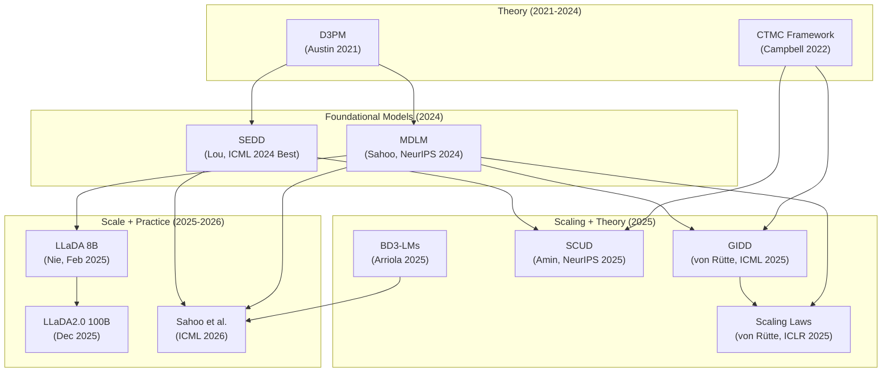
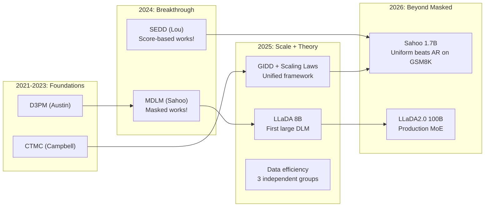

# Diffusion Language Models: State of the Art, March 2026

**Query:** What is the current state of discrete diffusion language models? How do they compare to autoregressive LMs, what are the key approaches, and where is the field heading?
**Date:** 2026-03-03 | **Sources analyzed:** 14 top-tier + 8 second-tier | **Languages:** EN, CN
**Research scope:** arXiv 2024-2026, OpenAlex, Semantic Scholar, HN, Reddit, Zhihu, CSDN, practitioner blogs. Focused on discrete diffusion (masked, uniform, score-based) for text. Excluded continuous diffusion for images.

---

# Tier 1: Decision-Ready Brief

## Problem Statement

Autoregressive language models (AR) generate text left-to-right, one token at a time. Discrete diffusion language models (DLMs) instead corrupt text with noise and learn to denoise, generating all tokens in parallel across multiple refinement steps. The question: can DLMs match or beat AR on quality, scale, and practicality?

## State of the Art (March 2026)

LLaDA 8B (Nie et al., Feb 2025) is the largest open-weight DLM: 8B parameters, 2.3T tokens, matching LLaMA3-8B on MMLU (65.9 vs 65.4) and GSM8K (70.7 vs 53.1). LLaDA2.0-flash scales to 100B via MoE (Dec 2025). MDLM (Sahoo et al., NeurIPS 2024) proved masked diffusion is competitive at small scale (PPL within 14% of AR at 110M params). SEDD (Lou et al., ICML 2024 Best Paper) showed score-based discrete diffusion matches GPT-2 quality with 4x better distribution fidelity. Sahoo et al. 2026 (ICML) scaled three DLM families to 1.7B, finding uniform-state diffusion beats AR and masked on GSM8K (65.8% vs 62.9% vs 58.8%) despite worse perplexity.

## Key Approaches

| Approach | Key System | Best Result | Status |
|----------|-----------|-------------|--------|
| Masked diffusion | LLaDA 8B | MMLU 65.9, GSM8K 70.7 (matches LLaMA3) | Proven at 8B scale |
| Uniform-state diffusion | Duo (Sahoo 2026) | GSM8K 65.8% at 1.7B (beats AR) | Emerging, scaling promising |
| Score-based (SEDD) | SEDD-medium | PPL within 10% of GPT-2, 4x fidelity | Proven at 320M |
| Block diffusion | BD3-LMs | Semi-AR generation for long sequences | Emerging, limited eval |
| Interpolating (GIDD) | GIDD+ | PPL 22.29 at 92M, self-correction | Theoretical, small scale |
| Schedule-conditioned (SCUD) | SCUD | LM1B PPL 37.63 (unlocks structured noise) | Theoretical, small scale |

## What Works

**Masked diffusion at scale.** LLaDA proves the approach works: 8B parameters, full pre-training + SFT pipeline, competitive with LLaMA3 across general, math, and code benchmarks. The recipe is straightforward — bidirectional transformer, random token masking as forward process, cross-entropy on masked positions. LLaDA even breaks the reversal curse (42.4% vs GPT-4o's 34.3% on reverse poem completion), confirming bidirectional attention gives real capability advantages on non-left-to-right tasks.

**Data efficiency in the multi-epoch regime.** Three independent groups (Prabhudesai CMU, Ni NUS/Sea, Gao Ubiquant) confirm DLMs resist overfitting far longer than AR when repeating training data. Prabhudesai's controlled study of 200 models quantifies the gap: DLMs have a data reuse half-life of 513 epochs vs AR's 32 — a 16x difference. The mechanism is masking diversity: each training step sees a different random subset of tokens masked, creating 2^L possible training signals per L-token sequence vs AR's single left-to-right factorization. Gao et al. add a wrinkle: simple MLP dropout (0.1) + weight decay (0.5) on AR models closes most of the gap, suggesting the advantage is "built-in regularization" rather than a fundamental architectural win. Ni et al. dispute this, claiming regularization alone "cannot close the gap." The disagreement is unresolved.

**Uniform diffusion's surprising strengths.** Two results challenge the assumption that masked diffusion is always best. Von Rütte's scaling study (ICLR 2025) shows uniform diffusion has better loss scaling exponents (-0.0522 vs -0.0496 for masked), meaning it should win at large compute budgets (~10^21 FLOPs). Sahoo et al. 2026 confirm this empirically: at 1.7B parameters, uniform-state (Duo) beats both AR and masked on GSM8K mathematical reasoning (65.8% vs 62.9% vs 58.8%). The mechanism may be that uniform noise forces models to learn error detection (which token is wrong?) in addition to prediction (what should it be?), a capability masked models don't develop. GIDD shows this enables "self-correction" — iterative improvement of generated text — with up to 55% reduction in generative perplexity.

## What Doesn't Work (Yet)

**Inference speed.** DLMs need 10-1000 forward passes per sequence vs AR's L passes with KV-cached decoding. Ni et al. report 4700x inference FLOPs overhead at seq_len=4096. Sahoo 2026's Pareto analysis shows DLMs dominate only in specific throughput ranges; AR is still faster for high-quality generation. Block diffusion and speculative decoding partially mitigate this, but no DLM deployment matches AR serving efficiency.

**Perplexity parity at scale.** At 92M-320M params, DLMs trail AR by 14-38% on perplexity. LLaDA closes this at 8B but uses 0.13M H800 GPU-hours — substantial cost. The scaling laws predict convergence at 10^21-10^22 FLOPs, but nobody has observed the actual crossover on a matched compute budget.

**Alignment and instruction following.** LLaDA demonstrates SFT works for DLMs, but RLHF/DPO pipelines remain undeveloped. No DLM has been through the full alignment pipeline that makes AR models safe and useful. This is the largest practical gap.

## Recommended Next Steps (for Open-dLLM Phase 4)

1. **Keep masked diffusion for Phase 4.** At ~58M params on Kaggle T4, you're in the regime where masked dominates (uniform only wins at >>10^21 FLOPs). The scaling evidence supports this choice.

2. **Add MLP dropout 0.1 and increase weight decay to 0.3-0.5.** Free performance for multi-epoch training. Gao et al. show MLP dropout 0.1 gives +4.5 points over vanilla AR; the same mechanism should help DLMs that already do masking.

3. **Consider one experimental run with p_u=0.1 (low uniform noise).** GIDD's self-correction capability and Sahoo 2026's GSM8K results suggest small amounts of uniform noise develop qualitatively different capabilities. Low cost to test, potentially interesting findings.

4. **Track Sahoo 2026's Duo implementation.** Code at github.com/s-sahoo/scaling-dllms. Their sampling recipe (block sampler for uniform diffusion) may transfer to your block diffusion architecture.

5. **Watch LLaDA2.0 for training recipes.** The 100B MoE variant will reveal what works at true scale. Their data filtering pipeline (2.3T tokens with LLM-based quality scoring) is worth studying.

## Open Questions

- Does the DLM data efficiency advantage hold at frontier scale (70B+ params, 1T+ unique tokens)? Nobody has tested this.
- Can DLMs be aligned with RLHF/DPO? LLaDA SFT works, but no published results on preference learning.
- Is uniform diffusion's GSM8K advantage (Sahoo 2026) real or a fine-tuning artifact? Only one dataset, one scale.
- When will inference speed parity arrive? Speculative decoding + block generation + hardware optimization — but no concrete timeline.
- The Gao vs Ni contradiction: does regularization close the data efficiency gap or not? Scale and evaluation suite differences may explain it, but controlled experiments are needed.

---

# Tier 2: Field Map

## Subtopic A: Masked Diffusion — The Current Champion

### Evolution

Masked diffusion started with D3PM (Austin et al. 2021) treating [MASK] as an absorbing state. MDLM (Sahoo et al. NeurIPS 2024) made it practical: continuous-time ELBO, Rao-Blackwellized objective that reduces to weighted MLM losses, efficient SUBS parameterization. Two key tricks: (1) zero masking (set [MASK] logit to -inf), (2) carry-over unmasking (copy unmasked tokens directly). Together these dropped PPL from 28.5 to 27.0 at 110M params. At 327B training tokens, MDLM reaches 23.0 PPL vs AR's 20.9 — a 10% gap, down from 50%+ gaps in prior work.

LLaDA (Feb 2025) proved masked diffusion scales. Architecture: standard transformer (RMSNorm, SwiGLU, RoPE, multi-head attention without GQA). Training: 2.3T tokens, AdamW, warmup-stable-decay schedule. The decision to use vanilla MHA instead of GQA is interesting — DLMs can't use KV caching anyway (bidirectional attention), so GQA's memory savings during inference don't apply. Results at 8B: MMLU 65.9, GSM8K 70.7, HumanEval 33.5 — competitive with LLaMA3-8B across the board.

### Connections

Masked diffusion is a special case of GIDD (p_u=0), SCUD (gamma=1), and the general CTMC framework. The MDLM objective is equivalent to time-weighted MLM — in fact, removing time-step conditioning from the denoiser gives 2x inference speedup via caching with minimal quality loss (MDLM Table 8). This means "diffusion" adds almost nothing over MLM at the architectural level; the contribution is the continuous-time framework for principled sampling and likelihood evaluation.

### Consensus vs Debate

Agreement: masked diffusion works and scales. The recipe is settled (bidirectional transformer + random masking + cross-entropy).

Debate: is the MDLM NELBO or the low-variance cross-entropy objective better? Sahoo 2026 shows the low-variance objective is 12% more FLOPs-efficient for training but produces worse likelihood estimates. For downstream tasks, the low-variance objective wins because downstream accuracy depends on relative token probabilities, not absolute likelihood.

---

## Subtopic B: Uniform and Hybrid Diffusion — The Scaling Bet

### Evolution

Uniform diffusion replaces tokens with random vocabulary items instead of [MASK]. D3PM introduced it; everyone ignored it because masked was simpler and better. GIDD (von Rütte, ICML 2025) provided the first clean framework for mixing: pi_t = sigma(a*lambda+b)*u + (1-sigma(a*lambda+b))*m. The scaling paper (von Rütte, ICLR 2025) showed uniform has better loss exponents: L* ~ C^{-0.0522} vs C^{-0.0496} for masked. The crossover is predicted at ~10^21 FLOPs but called "highly unreliable."

Sahoo 2026 provides the first large-scale evidence. Their "Duo" model (uniform-state diffusion at 1.7B params) beats AR on GSM8K (65.8% vs 62.9%). The speed-quality Pareto frontier shows Duo dominates specific throughput ranges. Their "Eso-LM" (interpolating diffusion with causal attention) offers yet another trade-off point.

### The Self-Correction Discovery

GIDD's most surprising finding: models trained with any uniform noise (p_u >= 0.1) can iteratively improve their own outputs. The procedure: generate normally, then for each position, check if the model's prediction at t=0 differs from the generated token. If so, resample with low temperature (0.1-0.5). Repeat with patience 32. Result: up to 55% improvement in generative PPL. Mask-only models show zero self-correction ability.

Why: uniform noise forces the model to learn a discriminator ("is this token corrupted?") alongside the generator ("what should this token be?"). This mirrors ELECTRA's insight (Clark et al. 2020) — replaced token detection is a stronger training signal than masked token prediction.

### Connections

SCUD (Amin et al. NeurIPS 2025) provides the theoretical unification. By conditioning on the "jump schedule" (when transitions happen), SCUD separates the learning problem into "when to revise" (known from forward process) and "what to revise to" (learned). Setting gamma=1 recovers masked diffusion; gamma→0 recovers classical (SEDD-like) diffusion. SCUD achieves SOTA on proteins (BLOSUM matrix as structured noise) and competitive LM1B PPL (37.63). The practical implication: structured noise (beyond mask/uniform) can encode domain knowledge, and schedule conditioning makes it work.

### Consensus vs Debate

Agreement: uniform diffusion has theoretical advantages (better scaling exponents, self-correction, structured noise).

Debate: does it matter in practice? At current scales (<10B params), masked wins on perplexity. The GSM8K advantage (Sahoo 2026) is from a single fine-tuning experiment. The self-correction metric uses GPT-2-large as judge (known to favor repetitive text). Von Rütte admits the scaling crossover prediction is "highly unreliable."

---

## Subtopic C: Data Efficiency — The Strongest Practical Argument

### Three-Paper Convergence

Three groups independently confirm DLMs extract more signal per training example:

1. **Prabhudesai et al. (CMU, NeurIPS 2025):** 200 models, controlled design. R_D*=513 epochs for DLM vs 32 for AR. Critical compute threshold C_crit ~ U^2.174. Below threshold: AR wins. Above: DLM wins.

2. **Ni et al. (NUS/Sea, 2025):** Scales to 1.7B params, real benchmarks. 1B DLM on 1B tokens (96 epochs) hits 56% HellaSwag vs AR's 41%. Claims ~3x data efficiency. Honestly reports >100x training FLOPs and 4700x inference overhead.

3. **Gao et al. (Ubiquant, 2025):** The contrarian. 0.6B params, 3B tokens, 120 epochs. Token masking (not diffusion loss) is the active ingredient. MLP dropout 0.1 on AR beats DLM by 3.2 points (51.3 vs 48.1). Conclusion: regularization closes the gap.

### The Gao vs Ni Contradiction

Gao says AR + regularization matches DLMs. Ni says it "cannot close the gap." Possible reconciliation: (a) Gao tests at 0.6B, Ni at 1.7B — the gap may widen with scale; (b) Gao uses 6 easy benchmarks (no MMLU, no reasoning), Ni uses harder ones; (c) Gao's specific recipe (MLP dropout 0.1) may not be what Ni tested. Neither paper provides enough detail to resolve this definitively.

### Practical Implication

For data-constrained settings (Kaggle T4, limited compute, small unique data budget), the data efficiency argument is strongest. All three papers agree DLMs win when repeating data many times. The disagreement is whether AR can be patched to match. Conservative recommendation: use DLM for inherent efficiency, add dropout/weight-decay as bonus.

---

## Subtopic D: Scaling Laws — The Compute-Optimal Question

### Von Rütte Scaling Study (ICLR 2025)

510 runs, 25M-567M non-embedding params, 5 noise types. Methodology: CompleteP (hyperparameter transfer across width and depth) + iso-FLOP profiles.

Key exponents:

| Noise | M* ~ C^a (params) | D* ~ C^b (data) | L* ~ C^c (loss) |
|-------|-------------------|------------------|------------------|
| Masked | C^0.566 | C^0.434 | C^{-0.0496} |
| Uniform | C^0.589 | C^0.411 | C^{-0.0522} |
| Chinchilla AR | C^0.49 | C^0.51 | — |

DLMs are ~20% more parameter-hungry than AR (C^0.57 vs C^0.49). This means at a given compute budget, DLMs should allocate more to parameters and less to data than Chinchilla suggests. The batch size finding is independently useful: B* ~ D^0.82 and independent of model size.

### Sahoo 2026 Scaling Study

IsoFLOP analysis at {6e18, 1e19, 3e19, 6e19, 1e20} FLOPs. Key compute multipliers vs AR: masked 14-16x, uniform (Duo) 23x, interpolating (Eso-LM) 32x. With the low-variance objective, masked improves to 14x (the "12% efficiency" claim).

### Connections

The two scaling studies agree that DLMs need more compute than AR for the same loss. They disagree on whether this matters: von Rütte emphasizes the better loss exponents (uniform wins long-term), Sahoo emphasizes the Pareto frontier including inference (AR still best for quality-per-token-per-second).

---

## Subtopic E: Reasoning and Planning — Where Diffusion Has a Theoretical Edge

### Ye et al. (ICLR 2025): Synthetic Benchmarks

6M-parameter DLM solves Sudoku at 100% where LLaMA-13B gets 32.9%. MDM at 85M beats GPT-2-85M on Countdown by 9x (46.6% vs 5.1%). The mechanism: AR must predict hard intermediate steps using only left context; diffusion decomposes hard subgoals into easier partial-denoising problems across multiple noise levels.

Red flag: all tasks are synthetic constraint satisfaction. No natural language reasoning tested.

### Sahoo 2026: GSM8K at Scale

Uniform-state Duo at 1.7B beats AR on GSM8K (65.8% vs 62.9%) after fine-tuning on 385K augmented samples. This is the first DLM win on a real math benchmark at >1B scale. But: left-to-right sampling used for all models (including DLMs), so the bidirectional generation advantage is not tested.

### LLaDA 8B: Full Benchmark Suite

GSM8K 70.7% (base) and 78.6% (instruct) vs LLaMA3-8B's 53.1% (base) and 78.3% (instruct). Competitive across the board. The base model advantage (70.7 vs 53.1) is striking and may reflect bidirectional attention helping mathematical reasoning even before instruction tuning.

---

## Relationship Diagram

## Timeline

---

# Tier 3: Annotated Source Collection

**Total sources:** 22 | **Deep-analyzed:** 14 | **Second-tier:** 8
**Languages:** EN (20), CN (2) | **Date range:** 2021-2026

---

## Academic Sources — Top-Tier

### [DEEP-READ] LLaDA: Large Language Diffusion Models
**Metadata:** https://arxiv.org/abs/2502.09992 | Feb 2025 | ~300 citations | EN | PAPER

**Verdict:** First proof that masked diffusion scales to 8B parameters and matches state-of-the-art AR models across all standard benchmarks.

LLaDA trains on 2.3T tokens using 0.13M H800 GPU-hours. Architecture: 32 layers, 4096 hidden, 32 heads, 126K vocab, RMSNorm + SwiGLU + RoPE. No GQA (unnecessary since DLMs can't use KV caching). Forward process: random masking with rate t ~ U[0,1]. Loss: cross-entropy on masked tokens weighted by 1/t. The training recipe adapts standard AR practices: warmup-stable-decay schedule, data quality filtering with LLM scoring, 4096 context length.

| Metric | LLaDA-8B | LLaMA3-8B |
|--------|----------|-----------|
| MMLU | 65.9 | 65.4 |
| GSM8K | 70.7 | 53.1 |
| HumanEval | 33.5 | 34.2 |
| Reverse poem | 42.4% | 34.3% (GPT-4o) |

SFT on 4.5M instruction pairs produces competitive instruct model. Remasking strategies matter: low-confidence remasking + semi-autoregressive beats random by 12+ points on GSM8K base (64.7% vs 52.3%).

**Unique Angle:** Breaks the reversal curse. LLaDA generates reversed poems at 42.4% accuracy vs GPT-4o's 34.3%. Bidirectional attention enables non-sequential reasoning that AR architecturally cannot.

**Limitations:** 0.13M H800 GPU-hours is enormous. No RLHF. Inference 10-100x slower than KV-cached AR. The "low-confidence remasking" search (testing random, lowest-confidence, semi-AR, combined) suggests the sampling recipe is not settled.

**[DEEP-READ]** — The reference implementation for scaled DLMs. Read for architecture decisions and training recipe.

---

### [DEEP-READ] MDLM: Simple and Effective Masked Diffusion Language Models
**Metadata:** https://arxiv.org/abs/2406.07524 | Jun 2024 | NeurIPS 2024 | ~150 citations | EN | PAPER

**Verdict:** Made masked diffusion practical by proving the continuous-time ELBO reduces to weighted MLM — the simplicity that enabled everything after.

110M params (DiT + rotary embeddings). Two loss improvements: (1) continuous-time formulation avoids discretization error of T=1000 steps, (2) Rao-Blackwellization reduces variance by analytically computing expectations. The SUBS parameterization (zero masking + carry-over unmasking) drops PPL from 28.5 to 27.0. Semi-autoregressive generation: generate L' tokens at a time, prepend to prompt, repeat. 25-30x faster than SSD-LM at better quality.

| Dataset | MDLM | AR Baseline | SEDD |
|---------|------|-------------|------|
| LM1B (327B tok) | 23.00 PPL | 20.86 | 32.79 |
| OWT | 23.21 PPL | 17.54 | 24.10 |

The gap to AR (10-14%) persists but is the smallest for any DLM at the time. Representation learning: MDLM fine-tuning of BERT preserves GLUE scores (82.06 vs BERT's 81.62) while adding generative capability.

**Unique Angle:** The insight that removing time-step conditioning gives 2x inference speedup with minimal quality loss. If the denoiser doesn't need to know the noise level, the "diffusion" aspect is doing very little — it's effectively iterative MLM with a principled sampling schedule.

**Limitations:** 110M params only. No downstream benchmarks beyond GLUE. The AR gap is real and persistent at this scale.

**[DEEP-READ]** — The theoretical foundation paper. Read for the ELBO derivation, SUBS parameterization, and semi-AR generation.

---

### [DEEP-READ] SEDD: Discrete Diffusion Modeling by Estimating the Ratios of the Data Distribution
**Metadata:** https://arxiv.org/abs/2310.16834 | Oct 2023 | ICML 2024 Best Paper | ~200 citations | EN | PAPER

**Verdict:** Score matching for discrete spaces — model probability ratios instead of probabilities, avoid normalization constants, match GPT-2 with 4x better sampling fidelity.

Instead of predicting tokens directly, SEDD predicts s_theta(x)_y ≈ p(y)/p(x) — the ratio of probabilities between the current token and every alternative. The score entropy loss has a natural log-barrier preventing zero-support collapse that kills L2-based concrete score matching. Architecture: encoder-only transformer (90M-320M) with adaLN-zero time conditioning and rotary embeddings. Outputs log s_theta for positivity.

| Dataset | GPT-2-small | SEDD-small | GPT-2-med | SEDD-med |
|---------|-------------|------------|-----------|----------|
| WikiText2 | 42.43 | ≤44.75 | 31.80 | ≤34.85 |
| PTB | 138.43 | ≤130.49 | 123.14 | ≤93.26 |

SEDD beats GPT-2 on PTB (130 vs 138 small, 93 vs 123 medium) and is within 10% elsewhere. Absorbing (mask-like) transitions outperform uniform. The generation quality advantage is the real story: 4x better distribution fidelity than GPT-2 ancestral sampling, 16x fewer network evaluations for matched quality.

**Unique Angle:** The score parameterization. Instead of predicting clean tokens (MDLM approach), predict ratios between alternatives. This avoids the mean parameterization failure mode where p([MASK]→token) transitions get stuck.

**Limitations:** Encoder-only architecture limits deployment options. No instruction following or chat capability. Absorbing transitions work better than uniform, partially undermining the "structured noise" argument.

**[DEEP-READ]** — The alternative theoretical framework to MDLM. Read for the score entropy loss derivation and the ratio-vs-probability comparison.

---

### [DEEP-READ] Von Rütte et al.: Scaling Behavior + GIDD
**Metadata:** https://arxiv.org/abs/2512.10858 (scaling) + https://arxiv.org/abs/2503.04482 (GIDD) | 2025 | ICLR + ICML 2025 | EN | PAPER

**Verdict:** The first Chinchilla-for-diffusion study. 510 runs establishing scaling exponents across 5 noise types, unified by the GIDD theoretical framework.

See [full analysis](./papers/vonrutte_2025_scaling_and_gidd.md) for complete details.

Key scaling exponents: masked M*~C^0.566, uniform M*~C^0.589, vs AR C^0.49-0.52. DLMs are 20% more parameter-hungry. But uniform has better loss scaling (-0.0522 vs -0.0496), predicting crossover. GIDD unifies masked/uniform via time-varying mixing pi_t, decomposes ELBO into KL (what to predict) + Itakura-Saito (when to revise), proves schedule invariance (any noise schedule gives the same bound). Self-correction: models with p_u>=0.1 improve their own outputs by up to 55%.

**Limitations:** Scaling predictions extrapolated from sub-10B scale. No generation quality metrics. Single dataset (Nemotron-CC).

**[DEEP-READ]** — Required reading for compute planning and noise type selection.

---

### [DEEP-READ] Sahoo et al. 2026: Scaling Beyond Masked Diffusion
**Metadata:** https://arxiv.org/abs/2602.15014 | Feb 2026 | ICML 2026 | EN | PAPER

**Verdict:** The most practical scaling study — compares masked, uniform, and interpolating DLMs to 1.7B with speed-quality Pareto analysis. Uniform wins on GSM8K despite worse perplexity.

Three DLM families at compute budgets up to 10^20 FLOPs. The 12% efficiency claim: masked diffusion with low-variance cross-entropy objective needs 14x compute instead of 16x to match AR loss — meaningful but still far from parity. Compute multipliers vs AR: masked 14-16x, Duo (uniform) 23x, Eso-LM (interpolating) 32x.

The GSM8K result is the headline: Duo 65.8%, AR 62.9%, MDLM 58.8% — after fine-tuning on 385K augmented samples. Perplexity tells the wrong story here: MDLM has better perplexity than Duo but worse downstream accuracy. The finding that "perplexity is informative within a family but misleading across families" is the paper's most important methodological contribution.

Speed-quality Pareto: AR dominates at high quality targets. Duo dominates at [200,400] and [600,∞) tokens/sec ranges. Practical takeaway: choose your DLM variant based on your throughput target, not your perplexity target.

**Limitations:** GSM8K is one benchmark. All DLMs sampled left-to-right (not parallel), so the bidirectional generation advantage is untested. Fine-tuning protocol tuned separately for each model family.

**[DEEP-READ]** — The most current comprehensive comparison. Code at github.com/s-sahoo/scaling-dllms.

---

### Gao et al. 2025: What Makes DLMs Super Data Learners?
**Metadata:** https://arxiv.org/abs/2510.04071v1 | Oct 2025 | EN | PAPER

**Verdict:** Token masking (not diffusion loss) is the active ingredient for data efficiency — and MLP dropout 0.1 on AR models achieves the same effect, scoring 51.3 vs DLM's 48.1.

See [full analysis](./papers/gao_2025_super_data_learners.md) for complete details.

Clean ablation at 0.6B params, 3B tokens, 120 epochs. Key result: diffusion-style input with AR loss (47.98) matches full DLM (48.08), proving the loss function barely matters. MLP dropout 0.1 (51.30) beats everything. Weight decay 0.5 (49.95) also beats DLM.

**Unique Angle:** The unified view connecting AR, DLM, and token dropout is genuinely clarifying. Token dropout for AR is exactly the DLM forward process applied to inputs.

**Limitations:** Single scale (0.6B), single data budget, 6 easy benchmarks, no code released, contradicts Ni et al. who found regularization insufficient.

**[SKIM]** — Read Section 2.4 (unified perspective) and Table 1 (main results). Skip the rest.

---

### Reasoning and Data Efficiency: Three-Paper Set
**Metadata:** arXiv:2410.14157, 2507.15857, 2511.03276 | 2025 | EN | PAPER

See [full analysis](./papers/reasoning_and_data_efficiency.md) for complete details.

**Ye et al. (ICLR 2025):** 6M DLM beats LLaMA-13B on Sudoku (100% vs 32.9%). Mechanism: multi-view subgoal decomposition. Limited to synthetic tasks.

**Prabhudesai et al. (NeurIPS 2025):** 200 models, R_D*=513 vs 32 epochs. The most rigorous data efficiency study. C_crit ~ U^2.174 predicts when DLMs win.

**Ni et al. (2025):** Scales to 1.7B. 1B DLM on 1B tokens (96 epochs) = 56% HellaSwag vs AR's 41%. Honestly reports >100x training and 4700x inference overhead.

**[SKIM]** — Read Prabhudesai for the scaling law framework. Skim others for the converging evidence.

---

### Amin et al. 2025: SCUD — Why Masking Diffusion Works
**Metadata:** https://arxiv.org/abs/2506.08316 | Jun 2025 | NeurIPS 2025 | EN | PAPER

**Verdict:** Masking diffusion wins because it "bakes in" the jump schedule — other methods waste capacity learning when to transition. SCUD generalizes this to any discrete diffusion.

The gamma parameter interpolates: gamma=1 → masked, gamma→0 → classical (SEDD). On proteins, SCUD with BLOSUM mutation matrix outperforms both classical and masking baselines. On language (LM1B), SCUD with sparse 10-nearest-neighbor graphs achieves 37.63 PPL — unlocking structured noise that was computationally intractable before.

**Unique Angle:** The "when vs where" decomposition is the cleanest theoretical explanation of why masked diffusion works. It predicts exactly when structured noise should help (when the structure encodes domain knowledge, e.g., BLOSUM for proteins).

**Limitations:** Small-scale experiments only. Language results modest (PPL 37 on LM1B). Within 10% compute overhead is good but needs validation at scale.

**[SKIM]** — Read Propositions 3.1, 4.3, 5.1 for the theoretical unification. Skip experiments.

---

## Academic Sources — Second-Tier

### LLaDA2.0: Scaling to 100B
**Metadata:** https://arxiv.org/abs/2512.15745 | Dec 2025 | EN | PAPER
MoE variants: LLaDA2.0-mini (16B) and LLaDA2.0-flash (100B). Instruction-tuned. Demonstrates DLMs work in the MoE regime. Limited public evaluation data as of March 2026.
**Tags:** [SKIM] [EN] [PAPER]

### LLaDA-V: Visual Instruction Tuning
**Metadata:** https://arxiv.org/abs/2505.16933 | May 2025 | EN | PAPER
Extends masked diffusion to multimodal (vision-language). Shows DLMs aren't limited to text-only.
**Tags:** [REFERENCE-ONLY] [EN] [PAPER]

### Dream 7B: Diffusion Large Language Models
**Metadata:** https://arxiv.org/abs/2508.15487 | Aug 2025 | EN | PAPER
Named "Dream" (not DREAM from CVPR 2024 which is image SR). 7B-parameter DLM with competitive performance. Adds to the evidence that masked diffusion scales.
**Tags:** [SKIM] [EN] [PAPER]

### Kim et al. 2025: Train for Worst, Plan for Best
**Metadata:** https://arxiv.org/abs/2502.06768 | Feb 2025 | ICML 2025 | EN | PAPER
Formal analysis of token ordering in masked diffusion. Shows masked diffusion trains for adversarial orderings, giving better worst-case generalization than AR's fixed ordering.
**Tags:** [SKIM] [EN] [PAPER]

### Bachmann & Nagarajan 2024: Pitfalls of Next-Token Prediction
**Metadata:** https://proceedings.mlr.press/v235/bachmann24a.html | 2024 | ICML 2024 | EN | PAPER
Theoretical analysis of AR limitations. Shows left-to-right factorization creates planning problems for certain task types. Supports the "diffusion helps reasoning" argument.
**Tags:** [REFERENCE-ONLY] [EN] [PAPER]

### Berglund et al. 2024: The Reversal Curse
**Metadata:** https://arxiv.org/abs/2309.12288 | 2024 | ICLR 2024 | EN | PAPER
AR models trained on "A is B" fail to learn "B is A." LLaDA explicitly breaks this curse via bidirectional attention.
**Tags:** [REFERENCE-ONLY] [EN] [PAPER]

### Kim et al. 2026: Any-Order Flexible Length Masked Diffusion
**Metadata:** https://openreview.net/forum?id=ttuNnMRI6H | 2026 | ICLR 2026 | EN | PAPER
Extends masked diffusion to variable-length generation (insertion/deletion). Addresses the fixed-length limitation.
**Tags:** [SKIM] [EN] [PAPER]

### Ding et al. 2026: Beyond Masks — Deletion-Insertion Processes
**Metadata:** https://openreview.net/forum?id=VbvXjs5f72 | 2026 | ICLR 2026 | EN | PAPER
Alternative to fixed-length masking: deletion-insertion processes that can change sequence length during generation.
**Tags:** [SKIM] [EN] [PAPER]

---

## Practitioner Sources

### LLaDA GitHub Repository
**Metadata:** https://github.com/ML-GSAI/LLaDA | 2025 | EN | REPO
Official implementation. PyTorch, HuggingFace model weights available. Active community (issues, PRs). The reference implementation for anyone building a DLM.
**Tags:** [DEEP-READ] [EN] [REPO]

### SEDD GitHub Repository
**Metadata:** https://github.com/louaaron/Score-Entropy-Discrete-Diffusion | 2024 | EN | REPO
Official ICML 2024 Best Paper code. Clean implementation. Good starting point for understanding the score-based approach.
**Tags:** [SKIM] [EN] [REPO]

### Sahoo 2026 Scaling Code
**Metadata:** https://github.com/s-sahoo/scaling-dllms | 2026 | EN | REPO
Code for all three DLM families (masked, Duo, Eso-LM) with scaling law experiments. Includes 1.7B model checkpoints.
**Tags:** [DEEP-READ] [EN] [REPO]

### GIDD GitHub Repository
**Metadata:** https://github.com/dvruette/gidd/ | 2025 | EN | REPO
Official GIDD code with DiT architecture, hybrid noise schedules, self-correction implementation.
**Tags:** [SKIM] [EN] [REPO]

---

## Social / Blog Sources

### Von Rütte Blog: "Why Diffusion Language Models Are the Future"
**Metadata:** https://dimitri.ml/posts/why-diffusion-language-models-are-the-future/ | Feb 27, 2026 | EN | BLOG
The trigger for this research survey. Well-argued opinion piece from ETH PhD student. Strong on CTMC theory and data efficiency. Weak on inference speed and alignment. Heavy self-citation (3/17 references).
**Tags:** [DEEP-READ] [EN] [BLOG]

### Aaron Lou Blog: SEDD Explained
**Metadata:** https://aaronlou.com/blog/2024/discrete-diffusion/ | 2024 | EN | BLOG
First-author explanation of SEDD. More accessible than the paper. Good for building intuition about score-based discrete diffusion.
**Tags:** [SKIM] [EN] [BLOG]

---

## [DEEP-READ] Flags Summary

Top 5 sources for understanding the field:
1. **LLaDA** (arXiv:2502.09992) — Proof that DLMs scale. The training recipe.
2. **MDLM** (arXiv:2406.07524) — The theoretical foundation. Why masked works.
3. **Sahoo 2026** (arXiv:2602.15014) — The practical comparison. Beyond masked.
4. **Von Rütte scaling + GIDD** (arXiv:2512.10858 + 2503.04482) — Compute planning. Noise type theory.
5. **Von Rütte blog** (dimitri.ml) — The opinionated synthesis. Where the field is heading.
