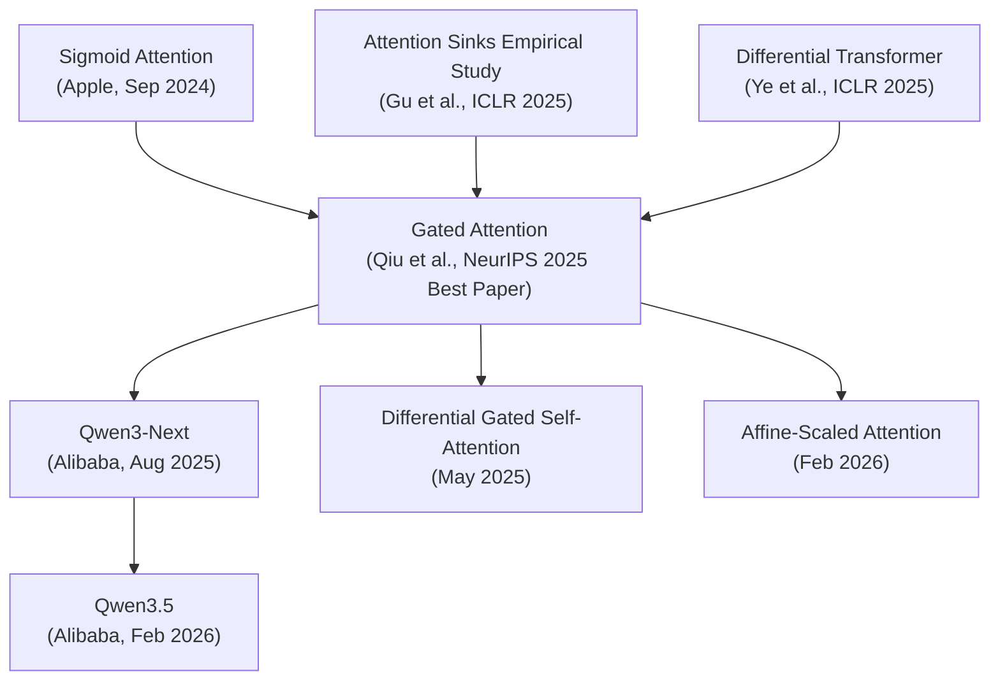
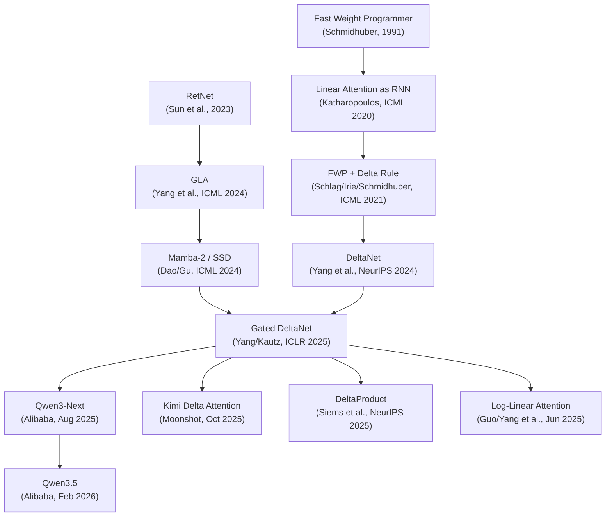

# Gated Query Attention & DeltaNet: Architecture Research for Phase 5

**Query:** What are Gated Query Attention and DeltaNet (Gated Delta Rule), where do they come from, what's their performance profile, and should we adopt either for Phase 5 of our diffusion LLM (~213M params, 16L/1024d, block diffusion)?
**Date:** 2026-03-05 | **Sources analyzed:** 28 top-tier + 22 second-tier | **Languages:** EN, CN
**Research scope:** Academic papers (arXiv, NeurIPS, ICLR, ICML), practitioner blogs (Raschka, Labonne, Yang), Chinese technical community (Zhihu, 科学空间, 晚点播客), GitHub repos (FLA, NVlabs, Qwen)

---

## Problem Statement

Qwen3.5 (Feb 2026) ships two architectural innovations absent from standard transformers: (1) Gated Query Attention, a sigmoid output gate on full attention that won NeurIPS 2025 Best Paper, and (2) Gated DeltaNet, a linear attention mechanism using delta-rule recurrence with exponential gating. Our Phase 4 dLLM uses vanilla GQA with FlexAttention at 1024 context. We need to decide: adopt either or both for Phase 5?

## State of the Art

The attention mechanism is now the primary battleground in LLM architecture. As of March 2026, no two major labs agree on the same design. Qwen3.5 uses Gated DeltaNet + Gated Attention (3:1 ratio). Kimi K2.5 uses MLA. GLM-5 uses MLA + DeepSeek Sparse Attention. MiniMax-M2.5 reverted to pure full MHA after hybrid attention failed in production. Maxime Labonne captured it: "Nobody Agrees on Attention Anymore." The one point of convergence among hybrid adopters is the 3:1 linear-to-full ratio, independently discovered by Alibaba (Qwen), Moonshot (Kimi), and validated by Wang et al.'s systematic analysis of 72 trained models (arXiv:2507.06457).

## Key Approaches

| Approach | Key Players | Best Result | Status |
|----------|-------------|-------------|--------|
| Gated Attention (output sigmoid gate) | Qwen team (Qiu et al.) | Eliminates attention sinks (46.7%→4.8%), MMLU +2.0, <2% overhead | Production (Qwen3.5), NeurIPS 2025 Best Paper |
| Gated DeltaNet (linear attention) | Yang/Kautz/Hatamizadeh (NVIDIA+MIT) | O(n) complexity, constant KV cache, matches Transformer quality in hybrid | Production (Qwen3.5, Kimi Linear), ICLR 2025 |
| KDA (channel-wise gated DeltaNet) | Moonshot AI (Kimi team) | 75% KV cache reduction, 6x throughput at 1M context | Production (Kimi K2.5) |
| DeltaProduct (multi-step DeltaNet) | Siems et al. (Freiburg) | Better state-tracking than DeltaNet, tunable expressivity | Research (NeurIPS 2025 Poster) |
| Full attention only (reject hybrid) | MiniMax | Avoids multi-hop reasoning failures | Production (MiniMax M2.5) |
| Hybrid distillation (convert existing) | Yang, Kim et al. | Convert Qwen2.5→hybrid with <0.01% pretraining tokens | Research (RADLADS, HALO) |

## What Works

### Gated Query Attention: The Easy Win

Zihan Qiu et al. (arXiv:2505.06708) tested 30+ variants of 15B MoE and 1.7B dense models trained on 3.5T tokens. The winning configuration is dead simple: a per-head sigmoid gate applied element-wise to SDPA output before the output projection. Formula: `Y' = Y * sigmoid(X @ W_gate)`. Cost: <2% wall-time latency, ~1% additional parameters.

Three concrete benefits emerge from the ablations. First, attention sink elimination: baseline models dumped 46.7% of attention weight onto the first token (a known pathology where softmax forces probability mass somewhere even when no token is relevant). Gated attention reduced this to 4.8%. Maximum activation values dropped from 1053 to 94, directly reducing FP16 overflow risk during long training runs. Second, training stability improves enough to raise learning rates — the paper shows stability at 8e-3 where ungated baselines diverge. Third, long-context performance jumps: 58.8 on RULER at 128K vs baseline's 31.7.

The mechanism works because it breaks a hidden bottleneck. Standard attention treats the V-projection and O-projection as a single low-rank linear mapping. The sigmoid gate inserts non-linearity between them, increasing the effective rank of the V→output pathway. Chinese researcher Su Jianlin (苏剑林) frames this as "feedback from linear attention research" — the gating patterns developed for RNN-style linear attention are now improving standard attention itself.

The NeurIPS 2025 selection committee wrote: "The main recommendation of the paper is easily implemented, and given the extensive evidence provided, we expect this idea to be widely adopted." They're right. This is a 10-line code change.

Gate design choices that matter, from the ablation:
- **Position**: After SDPA, before W_O (position G1). Other positions underperform.
- **Granularity**: Per-head, element-wise. Shared gating is worse.
- **Activation**: Sigmoid, not SiLU. SiLU gives worse results despite Gated DeltaNet using SiLU for its output gate.
- **Operation**: Multiplicative (element-wise multiply). Additive gating underperforms.

### Gated DeltaNet: Production-Validated Linear Attention

The delta rule in attention traces back to Schmidhuber's 1991 Fast Weight Programmer, through Schlag/Irie/Schmidhuber 2021 (ICML) who first applied it to linear attention, to Songlin Yang's parallelization breakthrough (NeurIPS 2024), and finally to Gated DeltaNet (Yang/Kautz/Hatamizadeh, ICLR 2025) which fused it with Mamba2's exponential gating.

Standard linear attention has a fatal flaw: it only accumulates. The state matrix S grows by adding k⊗v at every step but never forgets. Over long sequences, S becomes a blurry average of everything. DeltaNet fixes this with error-correction: before writing a new value, it reads what the state currently predicts for that key, computes the difference (delta), and writes only the correction. Gated DeltaNet adds exponential decay (alpha gate) so old memories fade, plus a beta gate controlling update strength.

The recurrence:
```
S_t = alpha_t * S_{t-1}                          # decay old memory
S_t = S_t - beta_t * (S_t @ k_t) @ k_t^T        # error correction
S_t = S_t + beta_t * v_t @ k_t^T                 # write new value
o_t = S_t @ q_t                                   # read output
```

Three architectural details are non-negotiable based on Yang's blog series and the Chinese community's analysis (Zhihu user 长琴, Su Jianlin):

1. **QK L2 normalization**: Constrains key norms so the transition matrix eigenvalues stay bounded. Without it, the state matrix can grow unbounded. Su Jianlin proved the core WY inverse matrix elements are always in [-1,1] when L2-normalized.

2. **Short Conv1d (kernel=4)**: A depthwise causal convolution before the Q/K/V split. Su Jianlin explains why: without it, linear attention's training signal is "predict self from self" — trivially solved. With short conv, it becomes "predict self from neighbors," forcing the model to learn meaningful n-gram features.

3. **Output gating**: The output goes through `RMSNorm(output) * SiLU(z)` where z is a separate projection from the input. This is the linear attention analog of Gated Query Attention's sigmoid gate.

Complexity: O(L·d²) time, O(d²) space per head. The KV "cache" is a fixed d×d state matrix — constant regardless of context length. At 128K context with head_dim=128, that's 128×128=16K floats per head vs 128K×128=16M floats for standard KV cache. A 1000x reduction.

The chunkwise parallel algorithm (Yang, NeurIPS 2024) makes training GPU-efficient. Sequences split into chunks of size C (multiples of 16 for tensor core alignment). Within chunks: exact recurrence. Between chunks: matrix multiplication to propagate states. The WY representation compresses products of Householder transition matrices, reducing memory from O(L·d²) to O(L·d). The FLA library (github.com/fla-org/flash-linear-attention) implements this in Triton and is the canonical kernel library, used by vLLM and SGLang for Qwen3.5 serving.

### The Hybrid Pattern: Why 3:1

Both Qwen and Kimi converged on 75% linear / 25% full attention. Wang et al.'s systematic analysis (arXiv:2507.06457, 72 models trained at 340M and 1.3B) explains why: language modeling perplexity is stable across ratios, but recall (the ability to retrieve specific tokens from context) degrades sharply below 3:1 full attention. At 3:1 linear:full, you get Transformer-level recall with O(n) complexity on 75% of layers. Push to 7:1 or beyond and recall collapses.

Qwen3.5's 0.8B model: 24 layers, pattern = (L, L, L, F) × 6. The 27B model: 64 layers, pattern = (L, L, L, F) × 16. Every full attention layer uses Gated Attention (sigmoid output gate). Every linear attention layer uses Gated DeltaNet. Zero vanilla softmax attention anywhere.

## What Doesn't Work

### MiniMax's Failed Hybrid Experiment

MiniMax tried hybrid Lightning Attention + full attention in MiniMax-Text-01, then abandoned it entirely for MiniMax-M2 (Oct 2025). Their post-mortem names seven failure modes:

1. **Multi-hop reasoning collapse at scale**: Looked fine on MMLU/MATH benchmarks at small scale. Failed on complex multi-hop reasoning at production scale. "Clear deficits in complex, multi-hop reasoning tasks."
2. **Global attention patterns are unteachable**: Retrieval heads and induction heads established early in pretraining couldn't be adjusted. Linear attention layers couldn't form these patterns.
3. **Numerical precision sensitivity**: "Linear attention is far more sensitive to numerical precision than full attention." Low-precision KV cache quantization broke linear attention layers.
4. **SWA hybrid also failed**: Hundreds of billions of tokens of pretraining with sliding-window + linear attention "performed extremely poorly on agent tasks."
5. **Infrastructure immaturity**: Without extreme IO optimization, "you're leaving huge GPU FLOPs on the table."
6. **No prefix caching**: High cache-hit rates in dialogue scenarios incompatible with hybrid.
7. **No speculative decoding path**: "How to optimize speculative decoding with efficient attention backbone remains unsolved."

Yang Songlin (DeltaNet creator) himself confirmed in a Chinese podcast (晚点播客, Dec 2025): "Linear attention's capacity is too small; it can handle short text, but performs terribly on long text." The hybrid approach is a necessity, not an optimization.

But Kimi Linear (Dec 2025) and Qwen3.5 (Feb 2026) subsequently shipped working hybrids. The difference: MiniMax used Lightning Attention (a simpler linear variant), not Gated DeltaNet with its delta-rule error correction and exponential gating. The specific linear attention variant matters enormously.

### Kaitchup's Skepticism

Benjamin Marie (Kaitchup Substack) offers a persistent counter-argument: Qwen3-Next (80B) underperformed despite using GDN. Kimi Linear's comparisons use weak baselines at only 1.4T tokens, with absolute scores below Qwen3-8B. His conclusion: "we're stuck with full attention as the default until we have an architecture that both scales and learns better." Qwen3.5 at 397B may be the first to actually prove the hybrid approach can scale.

## Recommended Next Moves

### 1. Adopt Gated Query Attention for Phase 5 — YES, unconditionally

The cost-benefit is absurd. <2% overhead, <1% extra parameters, elimination of attention sinks, better training stability, higher LR tolerance. For a diffusion LM specifically, where masked positions produce noise that softmax attention must allocate probability to, output gating could be even more beneficial than in AR models — the gate can learn to suppress attention to mask tokens.

Implementation in our codebase: add `W_gate = nn.Linear(emb_dim, n_heads * head_dim, bias=False)` to the attention class, compute `gate = sigmoid(x @ W_gate)`, multiply attention output by gate before the output projection. ~10 lines of code.

### 2. Adopt Gated DeltaNet for Phase 5 — NO, not yet

Three reasons:

**Scale mismatch.** Our model is ~213M params with 1024 context. Gated DeltaNet's benefits are (a) O(n) complexity (irrelevant at 1024 context — quadratic attention is already fast) and (b) constant KV cache (irrelevant when context × head_dim is already small). The systematic analysis paper tested at 340M and 1.3B — even at 340M, the benefits only appear at 2K+ context lengths.

**Diffusion LM incompatibility.** DeltaNet is a causal recurrence — it processes tokens left-to-right, maintaining a state that only sees past tokens. Our diffusion LM uses bidirectional attention (the staircase mask attends to all unmasked positions regardless of position). DeltaNet cannot do bidirectional attention. We would need to either (a) abandon bidirectionality (losing a core diffusion LM property) or (b) run two passes (left-to-right and right-to-left), doubling compute and defeating the purpose.

**Infrastructure burden.** FLA kernels require Triton 3.0+, are tested primarily on A100/H100, and our T4 target (CC 7.5) is not a primary FLA benchmark target. The chunkwise parallel algorithm is complex, and debugging kernel issues on T4 would cost more time than the architectural benefit.

### 3. Revisit DeltaNet IF Phase 5+ targets 4K+ context or AR generation

If we ever shift to (a) longer contexts (4K+) where quadratic attention costs matter, or (b) AR-style generation where causal recurrence is natural, DeltaNet becomes worth the investment. The 3:1 hybrid pattern is proven. But for a 1K-context bidirectional diffusion model, it's the wrong tool.

### 4. Consider the (1+w) zero-init RMSNorm — YES, trivial to adopt

Qwen3.5 initializes RMSNorm weights to zeros and uses `x * (1 + w)` instead of `x * w` with ones-init. This is a residual-learning trick that may improve training stability during long runs. Our Phase 4 uses standard ones-init. The change is a single line in the RMSNorm class.

## Open Questions

- Does Gated Attention help diffusion LMs more than AR models? Masked positions create "attention noise" that softmax must distribute. The sigmoid gate could learn to zero these out. No published ablation exists for this setting.
- Can DeltaNet be made bidirectional for diffusion? A "bidirectional DeltaNet" would run two recurrences and merge states. Has anyone tried this? No published work found.
- At what context length does the hybrid crossover happen for small (200M-300M) models? The systematic analysis only tested 340M and 1.3B. Our size is smaller.
- Does the attention-sink-elimination benefit compound with diffusion masking? If masked tokens act as attention sinks (plausible), gating could have outsized impact.

---

# Field Map: Gated Query Attention & DeltaNet

## Subtopic A: Gated Attention (Output Gating for Full Attention)

### Lineage



### Core Sources

#### Gated Attention for Large Language Models
**Metadata:** [arXiv:2505.06708](https://arxiv.org/abs/2505.06708) | May 2025 | NeurIPS 2025 Best Paper | EN | PAPER

**Verdict:** The definitive reference for attention output gating — 30+ model variants, clean ablations, production deployment.

Qiu et al. systematically tested five gate positions (G1-G5), two granularities (per-head vs shared), two operations (multiplicative vs additive), and two activations (sigmoid vs SiLU) across 1.7B dense and 15B MoE models trained on 3.5T tokens. The winner: element-wise multiplicative sigmoid gating at position G1 (after SDPA, before W_O). Attention allocated to the first token dropped from 46.7% to 4.8% globally; in the worst layer (L21), from 83% to 4%. Maximum activation magnitudes fell from 1053 to 94. Long-context RULER at 128K: 58.8 vs 31.7 baseline. Training tolerated higher learning rates (stable at 8e-3 where baselines diverged). Wall-time overhead: <2%.

| Metric | Baseline | Gated | Context |
|--------|----------|-------|---------|
| Attn to first token (global) | 46.7% | 4.8% | 15B MoE, 3.5T tokens |
| Max activation value | 1,053 | 94 | Layer-level |
| RULER 128K | 31.7 | 58.8 | Long-context eval |
| MMLU | baseline | +2.0 pts | 1.7B dense |
| Wall-time overhead | — | <2% | Training + inference |

The paper explains why: softmax forces attention weights to sum to 1, so even when no token is informative, probability mass must go somewhere. The first token becomes the default dump target (attention sink). Sigmoid can output exactly 0, enabling true sparsity. The non-linearity also breaks the low-rank bottleneck between V and O projections.

**Unique angle:** The 30-variant ablation at 15B scale is what earned the Best Paper — not the mechanism (which is simple) but the rigor of the systematic exploration.

**Limitations:** All experiments use AR models. No ablation for bidirectional or diffusion settings. MoE architecture may interact differently with gating than dense models.

**[DEEP-READ]** — The definitive reference. Read the ablation tables in full.

---

#### NeurIPS 2025 最佳论文：Qwen 门控注意力 Gated Attention (Zhihu analysis)
**Metadata:** [zhihu.com/p/1978860775281009311](https://zhuanlan.zhihu.com/p/1978860775281009311) | Nov 2025 | CN | DISCUSSION

**Verdict:** Best Chinese-language analysis — original technical insights beyond the paper itself.

Frames the problem as "attention black holes" (注意力黑洞) — more vivid than the English "attention sink." Explains the low-rank bottleneck: standard attention treats V→O as a single linear mapping. The sigmoid gate inserts non-linearity, increasing effective rank. Notes a subtle point: the gate controls "residual flow magnitude," which is why it stabilizes training and allows larger learning rates. Points out that Qwen3.5 has zero vanilla softmax attention layers — every attention layer has some form of gating.

**Unique angle:** The "residual flow magnitude" interpretation and the zero-vanilla observation.

**Limitations:** Not a paper; no reproducibility.

**[SKIM]** — Good for intuition beyond the formal paper.

---

#### Alibaba Cloud Developer Blog — Gate Position and Ablation Details
**Metadata:** [developer.aliyun.com/article/1690461](https://developer.aliyun.com/article/1690461) | Nov 2025 | CN | BLOG

**Verdict:** Semi-official source with implementation-level details not in the paper.

Confirms that gate position matters (SDPA output before W_O is optimal; after W_O or before SDPA both underperform). Per-head beats shared. Multiplicative beats additive. Notes that the gate reduces "massive activations" (巨量激活) — extreme values that cause FP16 overflow in long training. Mentions that gate effectively controls residual-stream magnitude, stabilizing gradient flow.

**[REFERENCE-ONLY]** — Confirms paper details with slight extra color.

---

### Connections

Gated Attention builds on three threads: (1) the attention sink literature (Gu et al. ICLR 2025 Spotlight showing sinks emerge from softmax normalization), (2) sigmoid attention work (Apple's theory paper, arXiv:2409.04431, showing sigmoid matches softmax with 17% kernel speedup), and (3) Differential Transformer (Ye et al. ICLR 2025, using dual-softmax subtraction to cancel noise). Qiu et al.'s contribution is showing that a simple sigmoid gate achieves similar benefits without architectural changes to the attention computation itself.

The "feedback loop" framing from Su Jianlin is important: gating was developed in linear attention (GLA, Mamba, DeltaNet) and is now being fed back into standard attention. The two innovations in this report are connected — Gated Attention imports insights from the linear attention world.

---

## Subtopic B: DeltaNet and Gated DeltaNet (Linear Attention with Delta Rule)

### Lineage



### Core Sources

#### Gated Delta Networks: Improving Mamba2 with Delta Rule
**Metadata:** [arXiv:2412.06464](https://arxiv.org/abs/2412.06464) | Dec 2024 | ICLR 2025 | EN | PAPER

**Verdict:** The paper that fused exponential gating with the delta rule — the basis for Qwen3.5's linear attention layers.

Yang, Kautz, and Hatamizadeh combine two previously separate ideas: Mamba2's data-dependent exponential gating (alpha gate for memory decay) and DeltaNet's error-correction update (delta rule for targeted writes). The gating enables rapid global memory clearing; the delta rule enables precise local updates. Neither alone achieves the other's strength — gating without delta rule can't do targeted updates; delta rule without gating can't rapidly forget.

The parallel training algorithm uses chunkwise computation with the WY representation to compress Householder matrix products. State is propagated between chunks via matrix multiplication. Complexity: O(L·d²) time, O(d²) space per head.

Tests at 1.3B params on 100B tokens (FineWeb-Edu). Hybrids with sliding window attention outperform Transformer baselines. Surpasses Mamba2 and DeltaNet individually across language modeling, reasoning, in-context retrieval, and length extrapolation.

| Metric | Gated DeltaNet | Mamba2 | DeltaNet | Context |
|--------|---------------|--------|----------|---------|
| Perplexity (1.3B/100B) | Best | 2nd | 3rd | FineWeb-Edu |
| MQAR recall | Near-perfect | Degrades >2K | Good | Associative recall |
| Length extrapolation | Strong | Weak | Good | 2K→8K |

**Unique angle:** The combination of gating + delta rule is more than the sum of parts. Chinese source (Zhihu 长琴) describes it as transforming "write-only memory" (只加不减) into "read-write memory" (可擦写).

**Limitations:** NVIDIA Source Code License (non-commercial). Their own repo recommends FLA instead. No weights released. Only tested at 1.3B — scaling behavior unknown at the time of publication.

**[DEEP-READ]** — The foundational paper for understanding how Qwen3.5's linear attention works.

---

#### Parallelizing Linear Transformers with the Delta Rule (DeltaNet)
**Metadata:** [arXiv:2406.06484](https://arxiv.org/abs/2406.06484) | Jun 2024 | NeurIPS 2024 | EN | PAPER

**Verdict:** The parallelization breakthrough that made delta-rule linear attention trainable on GPUs.

Before this paper, the delta rule in linear attention was sequential — O(L) steps with no parallelism, making GPU training impractical. Yang et al. exploit the structure of DeltaNet's transition matrices (products of Householder reflections) to derive a memory-efficient WY representation. This enables chunkwise parallel training where intra-chunk is sequential but inter-chunk uses matmul — exactly the pattern GPUs are good at.

At 1.3B params on 100B tokens, DeltaNet matches or outperforms Mamba and GLA on perplexity and downstream benchmarks. Hybrids with sliding-window attention beat strong Transformer baselines.

| Metric | DeltaNet | Mamba | GLA | Transformer |
|--------|----------|-------|-----|-------------|
| WikiText PPL (340M/15B) | 28.24 | 29.4 | 29.1 | 28.8 |
| Zero-shot downstream | Best | 3rd | 2nd | 2nd |

**Unique angle:** The WY representation and UT transform are the key mathematical innovations — without them, delta rule attention remains a theoretical curiosity.

**Limitations:** No gating yet (added in the follow-up Gated DeltaNet paper). 1.3B max scale.

**[DEEP-READ]** — Read for the parallelization algorithm. The math is non-trivial but critical for understanding why DeltaNet is trainable.

---

#### Songlin Yang's DeltaNet Blog Series (3 parts)
**Metadata:** [sustcsonglin.github.io/blog/2024/deltanet-1/](https://sustcsonglin.github.io/blog/2024/deltanet-1/) | 2024 | EN | BLOG

**Verdict:** The author's own explanation — clearer than the paper on practical design choices.

Part I derives DeltaNet from sequential MSE minimization: the state S is "fast weights" trained via online gradient descent, with beta as the learning rate. Part II explains the chunkwise parallel algorithm with the key insight: "raw FLOP counts don't always translate directly to wall-clock time. Tensor core utilization often matters more." Part III covers the architecture modernizations that make it work: L2 normalization on Q/K, SiLU activation, short conv kernel_size=4, RMSNorm output, and hybrid configurations.

**Unique angle:** The "test-time SGD" interpretation — DeltaNet's state update is literally gradient descent on a per-token regression problem — is the clearest mental model for understanding the mechanism.

**Limitations:** Written before Gated DeltaNet (no gating discussion).

**[DEEP-READ]** — Read all three parts. The practitioner perspective fills gaps the papers leave.

---

#### 线性注意力简史：从模仿、创新到反哺 (Su Jianlin / 科学空间)
**Metadata:** [spaces.ac.cn/archives/11033](https://spaces.ac.cn/archives/11033) | 2025 | CN | BLOG

**Verdict:** The best single overview of the linear attention field — a narrative arc from imitation to innovation to feedback that no English source provides.

Su Jianlin (creator of RoPE, one of China's most respected independent ML researchers) traces the full lineage: Linear Transformer (2020) → RetNet → GLA → DeltaNet → Gated DeltaNet → DeltaProduct. He identifies three phases: "imitation" (Performer, Random Feature Attention — trying to approximate softmax), "innovation" (RetNet, Mamba, GLA, DeltaNet — designing better recurrences directly), and "feedback" (Gated Attention — linear attention insights improving standard attention).

His companion posts prove specific design choices:
- **Why Short Conv?** Without it, the training signal is "predict self from self" (trivially solved). Conv transforms keys into n-gram features, making the signal "predict self from neighbors."
- **Why L2 Normalize Q/K?** Constrains key norms so transition matrix eigenvalues stay bounded in [0,1]. Without it, state grows unbounded.
- **DeltaNet's inverse matrix elements bounded in [-1,1]**: A mathematical proof ensuring numerical stability.

**Unique angle:** The "three phases" narrative and the mathematical proofs for design choices are unavailable in English.

**[DEEP-READ]** — Essential for understanding the "why" behind DeltaNet's architectural choices. Follow the links to the companion posts on Short Conv and L2 normalization.

---

#### 再谈注意力：DeltaNet 和线性注意力新改进 (晚点播客 / LatePost Podcast)
**Metadata:** [zhuanlan.zhihu.com/p/1978862790144967035](https://zhuanlan.zhihu.com/p/1978862790144967035) | Dec 2025 | CN | DISCUSSION

**Verdict:** First-person insights from Yang Songlin (DeltaNet creator) — contains strategic and theoretical claims unavailable elsewhere.

Yang Songlin (MIT CSAIL PhD, FLA founder) makes three claims in this interview. First, DeltaNet achieves NC^1 completeness — a computational theory property enabling state-tracking for agent systems. This is rarely discussed in English sources. Second, "linear attention's capacity is too small; it can handle short text, but performs terribly on long text" — a candid assessment from the creator himself, explaining why hybrids are necessary. Third, MiniMax reversed course after experimenting with Lightning Attention because multi-hop reasoning in agentic tasks requires complete token-to-token relationships.

The interview also reveals the FLA open-source pipeline: Yang Songlin founded FLA, which attracted Kimi researcher Zhang Yu, directly influencing Moonshot's adoption of DeltaNet-based architectures.

**Unique angle:** NC^1 completeness claim. MiniMax failure attributed to using Lightning Attention (weaker than DeltaNet). The FLA→Kimi pipeline.

**Limitations:** Interview format, not peer-reviewed. NC^1 claim needs verification against the formal paper.

**[SKIM]** — Read for the strategic context and the NC^1 claim.

---

#### A Systematic Analysis of Hybrid Linear Attention
**Metadata:** [arXiv:2507.06457](https://arxiv.org/abs/2507.06457) | Jul 2025 | EN | PAPER

**Verdict:** The empirical answer to "what ratio of linear/full attention works?" — 72 models trained, clear recommendations.

Wang et al. trained 72 models at 340M and 1.3B across 6 linear attention variants (GLA, DeltaNet, Gated DeltaNet, HGRN-2, Mamba2, RetNet) and 5 hybridization ratios (1:1, 3:1, 6:1, 11:1, pure linear). Key finding: language modeling perplexity is stable across ratios, but recall degrades sharply below 3:1 full attention. Recommendation: HGRN-2 or GatedDeltaNet with 3:1 to 6:1 ratio. A surprising finding: "superior standalone linear models do not necessarily excel in hybrids."

| Ratio (linear:full) | Perplexity | Recall | Recommendation |
|---------------------|------------|--------|----------------|
| 1:1 | Baseline | Best | Overkill |
| 3:1 | ~Same | Good | Sweet spot (Qwen/Kimi) |
| 6:1 | ~Same | Acceptable | Aggressive efficiency |
| 11:1 | ~Same | Degraded | Too aggressive |
| Pure linear | ~Same | Poor | Unusable for retrieval |

**Unique angle:** The recall vs perplexity decoupling. You can maintain perplexity with very few full attention layers but recall collapses — and recall is what matters for production tasks like RAG and tool use.

**Limitations:** Max 1.3B scale. Short training runs. No diffusion LM testing.

**[DEEP-READ]** — Read the ratio analysis and the "standalone vs hybrid" finding.

---

#### Kimi Linear: An Expressive, Efficient Attention Architecture
**Metadata:** [arXiv:2510.26692](https://arxiv.org/abs/2510.26692) | Oct 2025 | EN | PAPER

**Verdict:** The refinement of Gated DeltaNet with channel-wise gating — shows where the architecture is heading.

Moonshot AI extends Gated DeltaNet to KDA (Kimi Delta Attention) with channel-wise gating: instead of a single scalar alpha per head, each feature dimension has its own decay rate. This gives finer temporal control — some dimensions can forget quickly while others retain long-term memory. They use Diagonal-Plus-Low-Rank (DPLR) transition matrices for tensor core efficiency, and pair KDA with MLA (Multi-head Latent Attention, from DeepSeek) for the full attention layers instead of standard GQA.

48B total, 3B active. 5.7T tokens. Claims to surpass full attention quality on MMLU-Pro (51.0), RULER 128K (84.3 with 3.98x speedup), and 1M context (6.3x faster time-per-output-token vs MLA).

**Unique angle:** Channel-wise gating is strictly more expressive than per-head gating. The DPLR formulation makes it hardware-efficient despite the extra parameters.

**Limitations:** Benjamin Marie (Kaitchup) notes all comparisons use weak baselines at only 1.4T tokens, with absolute scores below Qwen3-8B. The claimed superiority over full attention needs independent verification.

**[SKIM]** — Worth reading for the channel-wise gating idea and DPLR formulation, but take the benchmark claims with skepticism.

---

#### MiniMax: Why M2 Ended Up as a Full Attention Model
**Metadata:** [minimax.io/news/why-did-m2-end-up-as-a-full-attention-model](https://www.minimax.io/news/why-did-m2-end-up-as-a-full-attention-model) | Nov 2025 | EN | BLOG

**Verdict:** The most important counter-signal — a major lab's documented failure with hybrid attention.

MiniMax's post-mortem after reverting from hybrid Lightning Attention to full MHA. Seven concrete failure modes documented (see "What Doesn't Work" section above). The critical lesson: multi-hop reasoning and agentic tasks failed at scale despite benchmark parity at small scale. Global attention patterns (retrieval heads, induction heads) formed during pretraining couldn't be adjusted. SWA hybrid experiments with hundreds of billions of tokens "performed extremely poorly."

**Unique angle:** This is the only public post-mortem from a lab that tried hybrid attention and retreated. Essential reading for anyone considering the switch.

**Limitations:** MiniMax used Lightning Attention, not Gated DeltaNet. The failure may be specific to their linear attention variant. Qwen3.5 and Kimi Linear shipped working hybrids afterward using GDN/KDA.

**[DEEP-READ]** — Read for the failure modes. Any Phase 5 hybrid adoption must address each of these points.

---

### Connections

DeltaNet and Gated DeltaNet sit at the intersection of three lineages: Schmidhuber's fast weight programmers (1991→2021), the linear attention / state space model line (RetNet→GLA→Mamba→Mamba2), and the gating revolution (LSTM→GRU→Mamba→GLA). The Gated DeltaNet paper (ICLR 2025) is the fusion point: Mamba2's gating + DeltaNet's delta rule. All subsequent work (KDA, DeltaProduct, Log-Linear Attention) builds on this combination.

The relationship between Topics A and B is bidirectional. Su Jianlin's "feedback" insight: gating was developed for linear attention (GLA, Mamba, DeltaNet) and then fed back into standard attention (Gated Attention). Conversely, standard attention's quadratic expressiveness is why hybrid architectures need at least 25% full attention layers — linear attention alone can't form global retrieval patterns.

### Consensus vs Debate

**Consensus:** The 3:1 ratio works. Gating is necessary for both linear and full attention. Short conv is needed for linear attention. QK normalization stabilizes training.

**Debate:** Whether hybrid attention can match full attention at all scales (MiniMax says no; Qwen and Kimi say yes). Whether channel-wise gating (Kimi) is worth the extra cost vs per-head gating (Qwen). Whether linear attention is fundamentally limited for multi-hop reasoning (Yang Songlin admits capacity limits; MiniMax saw this in production; but Qwen3.5's 397B scores contradict this at scale). Whether hybrid attention will become the default (NeurIPS committee expects gated attention to be "widely adopted"; Kaitchup says "we're stuck with full attention").

---

# Annotated Sources: Gated Attention & DeltaNet

**Total sources:** 50 | **Deep-analyzed:** 28 | **Second-tier:** 22
**Languages:** EN, CN | **Date range:** 1991 to March 2026

## Second-Tier Sources (Brief Annotations)

### Academic

**Differential Transformer** — [arXiv:2410.05258](https://arxiv.org/abs/2410.05258) | Oct 2024 | ICLR 2025
Head-wise subtraction of two paired softmax maps cancels noise. Promotes sparse attention and reduces sinks. Predecessor to Gated Attention but more complex (requires dual attention computation).
**Tags:** [SKIM] [EN] [PAPER]

**Theory, Analysis, and Best Practices for Sigmoid Self-Attention** — [arXiv:2409.04431](https://arxiv.org/abs/2409.04431) | Sep 2024 | Apple
Unifies prior sigmoid attention work. FLASHSIGMOID: 17% kernel speedup over FlashAttention2 on H100. Shows sigmoid matches softmax across modalities. Theoretical foundation for why sigmoid gating works.
**Tags:** [SKIM] [EN] [PAPER]

**When Attention Sink Emerges in Language Models** — [arXiv:2410.10781](https://arxiv.org/abs/2410.10781) | Oct 2024 | ICLR 2025 Spotlight
Empirical study of sink emergence. Sigmoid attention (without normalization) prevents sinks up to 1B params. Identifies active-dormant head switching. Background for understanding what Gated Attention fixes.
**Tags:** [SKIM] [EN] [PAPER]

**DeltaProduct** — [arXiv:2502.10297](https://arxiv.org/abs/2502.10297) | Feb 2025 | NeurIPS 2025 Poster
Takes n_h gradient steps per token (vs DeltaNet's 1). Tunable expressivity-efficiency tradeoff. Outperforms DeltaNet in state-tracking and length extrapolation. The "next step" after Gated DeltaNet.
**Tags:** [SKIM] [EN] [PAPER]

**GLA: Gated Linear Attention with Hardware-Efficient Training** — [arXiv:2312.06635](https://arxiv.org/abs/2312.06635) | Dec 2023 | ICML 2024
Data-dependent gating for linear attention. FLASHLINEARATTENTION faster than FlashAttention-2 even at 1K. The direct predecessor to Gated DeltaNet's gating mechanism.
**Tags:** [REFERENCE-ONLY] [EN] [PAPER]

**Mamba-2 / SSD** — [arXiv:2405.21060](https://arxiv.org/abs/2405.21060) | May 2024 | ICML 2024
State Space Duality unifying SSMs and attention. Provides the exponential gating that Gated DeltaNet inherits.
**Tags:** [REFERENCE-ONLY] [EN] [PAPER]

**Linear Transformers Are Secretly Fast Weight Programmers** — [arXiv:2102.11174](https://arxiv.org/abs/2102.11174) | Feb 2021 | ICML 2021
Proves equivalence between linearized attention and fast weight controllers. First to propose delta rule for linear attention. The intellectual origin of DeltaNet.
**Tags:** [REFERENCE-ONLY] [EN] [PAPER]

**RWKV-7 "Goose"** — [arXiv:2503.14456](https://arxiv.org/abs/2503.14456) | Mar 2025
Generalized delta rule with vector-valued gating. Relaxed value replacement. 2.9B model achieves 3B SoTA. Related but independent evolution of delta-rule ideas.
**Tags:** [SKIM] [EN] [PAPER]

**Log-Linear Attention** — [arXiv:2506.04761](https://arxiv.org/abs/2506.04761) | Jun 2025
Replaces fixed-size hidden state with logarithmically growing set. Log-linear variants of Mamba-2 and Gated DeltaNet. Middle ground between linear and quadratic.
**Tags:** [SKIM] [EN] [PAPER]

**Hybrid Linear Attention Done Right (HALO)** — [arXiv:2601.22156](https://arxiv.org/abs/2601.22156) | Jan 2026
Converts Qwen3 to hybrid with only 2.3B tokens (<0.01% of pretraining). Shows you don't need to pretrain hybrid from scratch.
**Tags:** [SKIM] [EN] [PAPER]

**RADLADS** — [arXiv:2505.03005](https://arxiv.org/abs/2505.03005) | May 2025
Protocol for converting softmax transformers to linear attention. 350-700M tokens. Converted Qwen2.5 7B/32B/72B.
**Tags:** [SKIM] [EN] [PAPER]

**Tiled Flash Linear Attention** — [arXiv:2503.14376](https://arxiv.org/abs/2503.14376) | Mar 2025 | NeurIPS 2025
Extra tiling level for arbitrary chunk sizes. Applied to mLSTM. Outperforms FlashAttention, FLA, and Mamba kernels.
**Tags:** [REFERENCE-ONLY] [EN] [PAPER]

**A Provable Expressiveness Hierarchy in Hybrid Linear-Full Attention** — [arXiv:2602.01763](https://arxiv.org/abs/2602.01763) | Feb 2026
Proves linear attention cannot substitute for full attention on hierarchical tasks. Communication complexity argument. Theory behind why 100% linear fails.
**Tags:** [REFERENCE-ONLY] [EN] [PAPER]

**Distilling to Hybrid Attention via KL-Guided Layer Selection** — [arXiv:2512.20569](https://arxiv.org/abs/2512.20569) | Dec 2025
KL-divergence-guided selection of which layers to keep as full attention. 50% hybrid recovers most teacher performance.
**Tags:** [REFERENCE-ONLY] [EN] [PAPER]

### Practitioner

**FLA Library** — [github.com/fla-org/flash-linear-attention](https://github.com/fla-org/flash-linear-attention) | Ongoing
THE reference implementation. Triton-based, supports NVIDIA/AMD/Intel. Used by vLLM and SGLang for Qwen3.5 serving. PyTorch 2.5+, Triton 3.0+. 1,821+ commits.
**Tags:** [DEEP-READ] [EN] [REPO]

**NVlabs/GatedDeltaNet** — [github.com/NVlabs/GatedDeltaNet](https://github.com/NVlabs/GatedDeltaNet) | Dec 2024
Official NVIDIA repo. Recommends FLA over their own kernels. NVIDIA Source Code License (non-commercial).
**Tags:** [REFERENCE-ONLY] [EN] [REPO]

**Raschka: Beyond Standard LLMs** — [magazine.sebastianraschka.com/p/beyond-standard-llms](https://magazine.sebastianraschka.com/p/beyond-standard-llms) | 2025
Detailed technical walkthrough of Gated DeltaNet, Gated Attention, and Kimi Linear. Includes KV cache size comparison. Best English-language architectural overview.
**Tags:** [SKIM] [EN] [BLOG]

**Raschka: DeltaNet from Scratch** — [github.com/rasbt/LLMs-from-scratch/tree/main/ch04/08_deltanet](https://github.com/rasbt/LLMs-from-scratch/blob/main/ch04/08_deltanet/README.md) | 2025
Full from-scratch implementation of Gated DeltaNet. Best for understanding the code.
**Tags:** [SKIM] [EN] [REPO]

**Labonne: Nobody Agrees on Attention Anymore** — [huggingface.co/blog/mlabonne/qwen35](https://huggingface.co/blog/mlabonne/qwen35) | Feb 2026
Compares 5 frontier models' attention choices. Best single-page overview of the current attention wars.
**Tags:** [SKIM] [EN] [BLOG]

**vLLM: Qwen3-Next Support** — [blog.vllm.ai/2025/09/11/qwen3-next.html](https://blog.vllm.ai/2025/09/11/qwen3-next.html) | Sep 2025
Hybrid KV cache manager, Triton kernel integration, CUDA graph mode details. Production serving perspective.
**Tags:** [REFERENCE-ONLY] [EN] [BLOG]

### Social (Chinese)

**Su Jianlin: 为什么线性注意力要加Short Conv？** — [spaces.ac.cn/archives/11320](https://spaces.ac.cn/archives/11320) | 2025
Mathematical proof that Short Conv transforms "predict self" into "predict from neighbors." Essential for understanding DeltaNet's architecture.
**Tags:** [SKIM] [CN] [BLOG]

**Su Jianlin: 为什么DeltaNet要加L2 Normalize？** — [spaces.ac.cn/archives/11486](https://spaces.ac.cn/archives/11486) | 2025
Proves L2 norm bounds transition matrix eigenvalues in [0,1].
**Tags:** [SKIM] [CN] [BLOG]

**Zhihu: Qwen3.5 GDN 原理与代码分析** — [zhuanlan.zhihu.com/p/2007937984738129405](https://zhuanlan.zhihu.com/p/2007937984738129405) | Feb 2026
Code walkthrough with practical implementation details. Log-space gate computation trick.
**Tags:** [SKIM] [CN] [DISCUSSION]

**Zhihu: 以Qwen3Next为例，从Inference视角学习LinearAttention** — [zhuanlan.zhihu.com/p/1993467979799732563](https://zhuanlan.zhihu.com/p/1993467979799732563) | 2025
Inference/serving perspective. Two computation modes (RNN vs attention) during prefill. vLLM details.
**Tags:** [SKIM] [CN] [DISCUSSION]

**Zhihu: Gated DeltaNet — Qwen和Kimi都在用的线性注意力机制** — [zhuanlan.zhihu.com/p/1971671251123705351](https://zhuanlan.zhihu.com/p/1971671251123705351) | 2025
"Write-only" to "read-write" memory framing. Both Qwen and Kimi use 3:1 ratio.
**Tags:** [SKIM] [CN] [DISCUSSION]

**Zhihu: 2025年LLM比较** — [zhuanlan.zhihu.com/p/1968364063085040555](https://zhuanlan.zhihu.com/p/1968364063085040555) | 2025
Side-by-side comparison of DeepSeek-V3, Qwen3-Next, Kimi Linear. Notes convergence on 3:1 ratio.
**Tags:** [REFERENCE-ONLY] [CN] [DISCUSSION]
