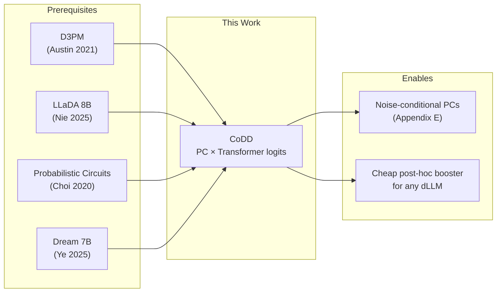
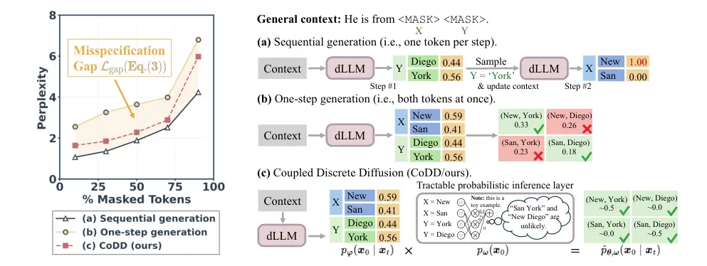
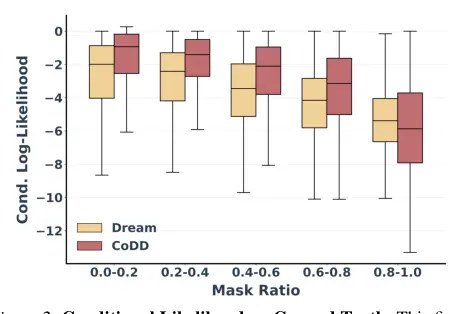
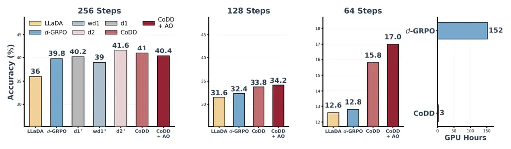
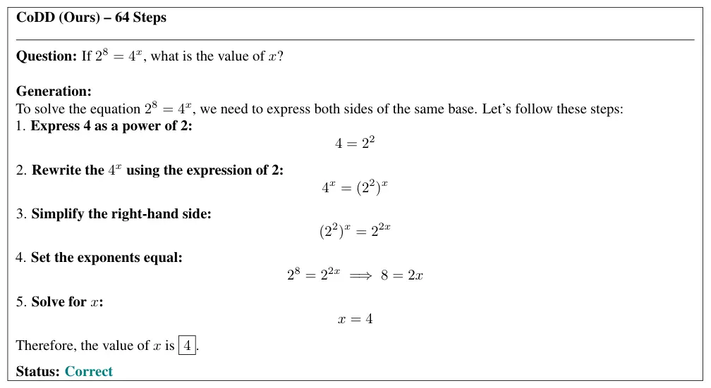
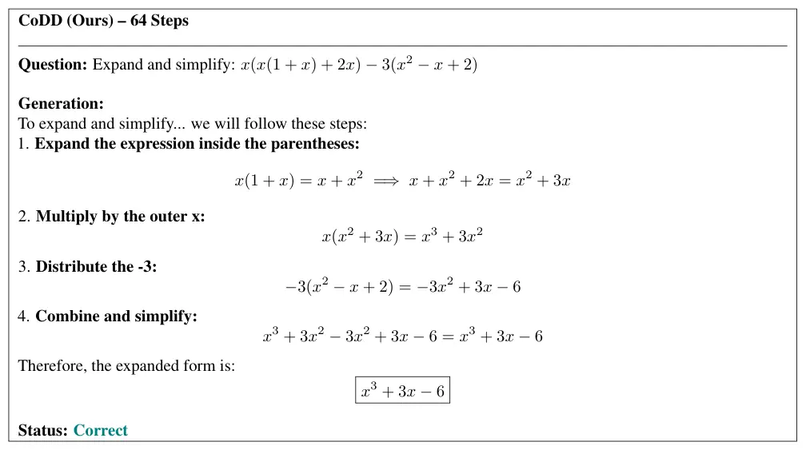
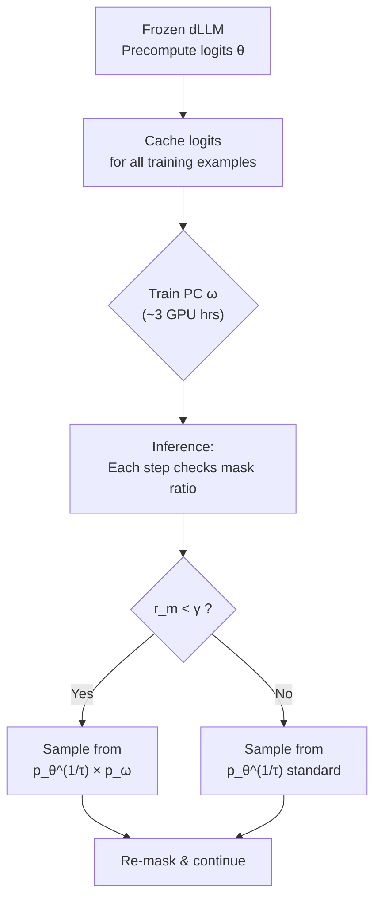
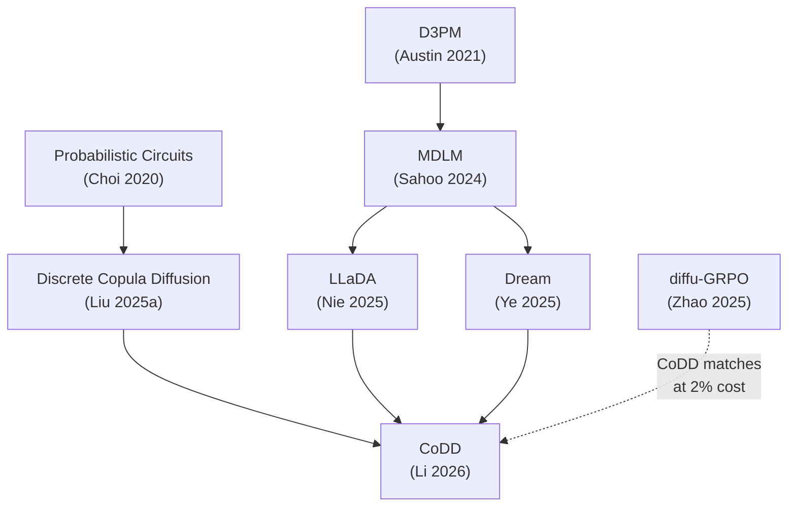

# Breaking the Factorization Barrier in Diffusion Language Models
**Authors:** Ian Li, Zilei Shao, Benjie Wang, Rose Yu, Guy Van den Broeck, Anji Liu  |  **Venue:** Preprint (arXiv:2603.00045)  |  **Links:** [arxiv](https://arxiv.org/abs/2603.00045) [code](https://github.com/liuanji/CoDD)
**Read:** 2026-03-05  |  **Rating:** 4/5  |  **Tags:** #diffusion-lm #probabilistic-circuits #factorization #inference #reasoning

---

## Tier 1 — Summary

**One-Sentence Takeaway:** Diffusion LMs suffer from a *structural* misspecification — the factorized output forces predicted tokens to be independent — and CoDD fixes this by multiplying the Transformer's logits with a Probabilistic Circuit prior, matching RL baselines on MATH500 (+5pp over LLaDA base) at ~2% of the GPU-hour cost while preventing mode collapse in few-step generation.

**What You Need to Know First:**
- Masked diffusion LMs: LLaDA (Nie et al., 2025), MDLM (Sahoo et al., 2024), D3PM (Austin et al., 2021) — specifically how the denoising step produces $p_\varphi(x_0 | x_t) = \prod_i p_\varphi(x_0^i | x_t)$ as a product of independent marginals
- Probabilistic Circuits: Choi et al. 2020 — DAG-based tractable models with sum/product/input nodes that support exact marginal computation. Hidden Markov Models are a special case
- Block diffusion vs. full diffusion decoding strategies (Arriola et al., 2025)
- Temperature scaling and confidence-based decoding heuristics in dLLMs

**Key Numbers**

| Metric | Value | Context |
|--------|-------|---------|
| MATH500 accuracy (LLaDA, 256 steps) | 41.00% | +5.0pp over LLaDA-block baseline (36.00%) |
| GSM8K accuracy (Dream, 128 steps) | 67.02% | +10.84pp over Dream-Entropy baseline (56.18%) |
| Training cost | ~3 GPU hours | <2% of diffu-GRPO's 152 GPU hours |
| Inference overhead | 4-5% | On Dream backbone, wall-clock per sample |
| GSM8K recovery at 64 steps | 56.41% | vs. LLaDA's 14.86% (catastrophic collapse prevented) |

**Dependency Map**

**Red Flags**
- Evaluated on only 2 base models (LLaDA-8B, Dream-7B), both instruction-tuned — no pre-training experiments, no smaller-scale ablations, no evidence this helps during training (only post-hoc)
- PC is a Hidden Markov Model with N=1024 hidden states — the structural prior is fixed across all noise levels, which the authors themselves flag as a limitation (Section 5.3, Appendix E)
- All benchmarks are math/code reasoning tasks — no general language generation quality metrics (perplexity, MAUVE, etc.)
- GPU-hour comparison uses NVIDIA RTX PRO 6000 Blackwell — different hardware than baseline papers, making the 3 vs. 152 hour claim hard to verify fairly

**Bottom Line:** Read and study. The core insight — that the factorization barrier is a structural problem, not a capacity problem — is the real contribution, and it's convincing. The PC-as-structural-prior idea is genuinely clever, cheap, and plug-and-play. Whether it matters for *pre-training* (as opposed to post-hoc reasoning boosting) remains unproven, but for anyone building dLLMs that need to reason, this is worth understanding deeply.

---

## Tier 2 — Details

### Section 1–2: The Problem Statement

The paper opens with a clean identification of a real problem. When a diffusion LM predicts multiple masked tokens simultaneously, it produces independent marginals:

$$p_\varphi(x_0 \mid x_t) = \prod_{i=1}^{L} p_\varphi(x_0^i \mid x_t)$$

This means if the context is "He is from `<MASK>` `<MASK>`", the model might assign P(San)=0.41 and P(York)=0.56 independently, leading to nonsensical combinations like (San, Diego)=0.23 getting positive probability when it shouldn't.

### Figure 1: The Misspecification Gap

What it shows: Left panel plots perplexity of LLaDA on MathInstruct validation across mask ratios. Sequential generation (one token at a time) stays low. One-step parallel generation diverges badly above 50% masking. CoDD sits between them, closing most of the gap.
Why it matters: This is the paper's strongest motivating evidence — the gap between curves (a) and (b) proves the factorization assumption itself causes degradation, independent of model capacity.
Key values: At 75% masking, sequential generation hits ~3.5 perplexity while one-step hits ~5.5 — a 57% penalty purely from the independence assumption. CoDD recovers to ~4.2.
Hidden detail: The right panel's toy example is effective pedagogy but hides that real sequences have far more complex dependency structures than two correlated city-name tokens.
Critical question: Would this gap look different on non-reasoning data? Math has unusually tight inter-token dependencies (digits in a number, variables in an equation). General prose might have a smaller misspecification gap.

The authors formalize the misspecification gap as a KL divergence:

$$\mathcal{L}_{\text{gap}} := \min_\varphi D_\text{KL}(p_\text{joint}(X_0 | x_t) \| p_\varphi(X_0 | x_t))$$

This is the gap between the true joint distribution the backbone has learned and the best factorized approximation it can output. The argument is clean: even with infinite capacity in $f_\varphi$, the factorized output form creates an information bottleneck. I find this convincing — it's not hand-waving about "dependencies" but a precise structural claim about the output parameterization.

**Expected:** I assumed the factorization barrier was primarily about model capacity — bigger models learn better marginals. **Reality:** The paper shows it's about the *output structure*, not capacity. The same backbone that fails in one-step mode recovers the correct joint in sequential mode. This reframing is the paper's real contribution.

### Section 4: The CoDD Architecture

The fix decomposes the denoising distribution into two parts:

$$\hat{p}_{\theta,\omega}(x_0 | x_t) := \frac{1}{Z} \cdot p_\omega(x_0) \cdot p_\theta(x_0)$$

| Symbol | Meaning | Range | Intuition |
|--------|---------|-------|-----------|
| $p_\theta(x_0)$ | Transformer's factorized logits | Per-token probs | What the backbone thinks, position by position |
| $p_\omega(x_0)$ | PC structural prior | Joint distribution | What token combinations are globally coherent |
| $Z$ | Partition function | Scalar > 0 | Makes the product a valid distribution |
| $\theta$ | Backbone parameters | Fixed (frozen) | Context-aware token predictions |
| $\omega$ | PC parameters | Learned | Inter-token dependency structure |

Plain English: take the Transformer's per-position predictions (which are good individually but ignore cross-position dependencies), multiply them by a learned structural prior that knows which token combinations are valid, and renormalize. The PC captures "San York is unlikely" without requiring the Transformer to encode that in its factorized output.

**Trick:** The factorized nature of $p_\theta$ is the key enabler. Because the Transformer outputs independent logits, they can be "split" to align with the PC's decomposable structure, pushing the partition function computation down to local operations. This means $Z$ is computed in time linear in the PC size via a single forward pass — no exponential summation.

The PC itself is instantiated as a Hidden Markov Model with N=1024 hidden states. An HMM is a specific (and rather constrained) subclass of PCs. The choice trades off expressiveness for simplicity: HMMs capture sequential dependencies but not arbitrary long-range interactions. For a 32-token block in block diffusion, sequential Markov dependencies between adjacent positions seem reasonable. For 512-token full diffusion, it's less obvious.

### Section 4.3: Training

Training is modular — freeze the Transformer backbone $f_\varphi$, precompute its logits $\theta$ for all training examples, then optimize only the PC parameters $\omega$ using the aneMone optimizer (Liu et al., 2025b). The training objective is the same ELBO as standard diffusion (Eq. 1), just with $\hat{p}_{\theta,\omega}$ substituted for $p_\varphi$:

$$\mathcal{L}(\omega, \varphi) := \mathbb{E}_{t, x_0, x_t}[w(t) \cdot \log \hat{p}_{\theta,\omega}(x_0 | x_t)]$$

This frozen-backbone training is what makes the 3 GPU-hour claim possible. No backpropagation through an 8B parameter Transformer — just optimize a ~1M parameter HMM on cached logits. That's a clever engineering choice, and it means CoDD can be applied to any pre-trained dLLM as a post-hoc module.

**Assumption audit — Fragility: Medium.** The paper assumes the frozen Transformer's logits are already good enough that the PC only needs to correct correlations, not token-level predictions. If the backbone has poor per-position accuracy (e.g., on out-of-distribution data), multiplying by a structural prior won't help — garbage in, structured garbage out.

### Section 5: Decoding

Two sampling strategies, both addressing the non-trivial temperature scaling problem:

**Latent Variable Sampling:** Sample a latent configuration $z$ from $\hat{p}_{\theta,\omega}(Z)$ (the routing decisions at sum nodes), which collapses the mixture into a single product of leaf distributions. Then apply temperature scaling to this conditional. This avoids the #P-hard problem of renormalizing a full PC after exponentiation.

**Any-Order Autoregressive (AO) Sampling:** Sample tokens one at a time from the PC-modulated distribution, updating context after each. This is sequential within a block but with an arbitrary order (not left-to-right). The order follows the baseline's reliability heuristic (e.g., highest confidence first).

**Adaptive Activation** (Section 5.3) is a practical detail that matters: the PC is activated only when the mask ratio drops below threshold $\gamma$. At high masking (early diffusion steps), dependencies are too abstract for a static PC to model; at low masking (late steps), the remaining tokens have tight local dependencies the PC can capture.

### Figure 2: Conditional Likelihood Crossover

What it shows: Conditional log-likelihood of CoDD vs. Dream on ground truth, binned by mask ratio.
Why it matters: Directly justifies adaptive activation — CoDD wins when mask ratio < 0.8, loses when mask ratio > 0.8.
Key values: At 0.0–0.2 masking, CoDD's median CLL is about –1 vs. Dream's –2. At 0.8–1.0, CoDD's variance explodes.
Critical question: The crossover at ~0.8 is on MathInstruct specifically. Would it shift on different data? The optimal $\gamma$ is likely domain-dependent, but they treat it as a fixed hyperparameter.

### Section 5.2: Block vs. Full Diffusion

CoDD works with both paradigms. For block diffusion ($L_b=32$), the PC covers one block — clean and natural. For full diffusion (512 tokens), PCs are trained on shorter contexts (32 or 128), so they introduce "Dynamic Windowing": select tokens to decode, cover them with PC windows, sample within each window. Multiple disjoint windows can be handled simultaneously.

This windowing approach is a reasonable approximation but reveals a tension: the PC is local (32–128 tokens) while full diffusion operates globally (512 tokens). The structural correction is applied locally, which means cross-window dependencies are still factorized. The paper doesn't test whether this matters empirically.

### Section 6: Experiments

Two backbone models, four benchmarks, three step counts.

**Table 1 (LLaDA, block diffusion):** CoDD boosts MATH500 from 36.00→41.00 (+5.0pp) at 256 steps with the Margin decoding strategy. The Margin + CoDD combo isn't tested — they report CoDD with Low Confidence and Margin separately but the best CoDD result uses Margin. At 64 steps, MATH500 goes from 7.40→15.80 (+8.4pp), but 15.80% is still not practically useful.

GSM8K gains are larger: at 128 steps, Low Confidence + CoDD hits 72.48 vs. baseline's 71.34 — but the delta over Margin is stronger: 66.41→72.48 (+6.07pp). At 256 steps, the results are tighter: 58.23→65.88 with Low Confidence, a +7.65pp gain.

**Table 2 (Dream, full diffusion):** This is where the gains are dramatic. GSM8K at 128 steps: Dream-Entropy gets 56.18%, CoDD pushes it to 67.02% (+10.84pp). At 64 steps, the recovery is stunning: from 33.97 (Dream-Random) to 56.41 (CoDD) — though the comparison isn't entirely fair since CoDD uses Entropy baseline while the lowest Dream result uses Random.

### Figure 3: Performance vs. RL Baselines and Training Cost

What it shows: Left three panels compare accuracy at 256/128/64 diffusion steps. Right panel shows GPU-hour training cost.
Why it matters: CoDD matches or beats RL methods (diffu-GRPO, d1, wd1, d2) at a fraction of the cost.
Key values: At 256 steps, CoDD+AO gets 40.4% vs. diffu-GRPO's 39.8%. CoDD costs 3 GPU hours, diffu-GRPO costs 152. That's a 50x cost reduction for comparable accuracy.
Hidden detail: The "CoDD + AO" variant (with any-order autoregressive sampling) adds meaningful gains at 64 steps: 17.0% vs. CoDD's 15.8%. But AO also adds inference latency — Table 3 shows 27% overhead at 64 steps.
Critical question: diffu-GRPO and d1/d2 are RL methods that optimize directly for task reward. CoDD optimizes likelihood. The fact that likelihood optimization matches RL on a reasoning benchmark is surprising and worth probing — is this because the PC recovers reasoning chains that were "in" the backbone but couldn't be expressed through factorized sampling?

**Inference latency** (Table 3): CoDD adds 4-5% overhead on Dream, 2.6-6.3% on LLaDA. CoDD+AO adds 27-33% on LLaDA at 64 steps (because AO requires sequential PC queries within a block). The overhead scales with the PC window size and number of tokens decoded per step.

### Appendix B: Ablation Studies

Tables 4 and 5 vary $\gamma$ (PC activation threshold) and $\tau$ (temperature) across step counts. On LLaDA MATH500 at 256 steps, the best $\gamma$ is 0.6 with Random decoding, while at 64 steps it's 0.7. The sweet spot moves with the compute budget, which makes sense — fewer steps means more tokens decoded per step, meaning the PC activates earlier.

Temperature sensitivity is modest: $\tau=0.1$ vs $\tau=0.2$ differences are within 1-2pp in most settings. This suggests the PC's contribution isn't primarily through sharper distributions but through structural correction.

**Gem (Appendix E):** The authors outline two future extensions — Latent-Space Modulation and Parameter-Space Modulation — that would make the PC noise-conditional. The first has the Transformer predict which PC sub-circuit to activate (Eq. 10), and the second has the Transformer directly predict PC edge weights. These aren't implemented, but either would address the static-PC limitation. The latent-space version is particularly interesting: the Transformer would output both token logits AND a distribution over PC routing decisions, letting the structural prior adapt to the current diffusion stage.

> "Our current implementation uses a single static PC $p_\omega(x_0)$, which essentially learns the 'average' dependency structure across all timesteps." — Appendix E, p.14

This is the paper's most honest admission. A static prior that captures "average" dependencies will necessarily be wrong at specific noise levels — oversmoothing at high noise, undersmoothing at low noise. The adaptive activation threshold $\gamma$ is a binary hack around a continuous problem.

### Qualitative Examples (Appendix F)

### Figure 4: Mode Collapse Recovery

What it shows: At 64 steps, LLaDA baseline degenerates into token repetition ("42222222...") while CoDD produces coherent step-by-step reasoning for a simple exponent equation.
Why it matters: This isn't just a quantitative improvement — it's a qualitative shift from gibberish to correct reasoning. Mode collapse (repeating tokens) is the most visible failure mode of aggressive parallel decoding, and the PC structurally prevents it by assigning near-zero probability to degenerate repetition patterns.

### Figure 5: Arithmetic Hallucination Prevention

What it shows: LLaDA correctly derives intermediate steps but drops terms in the final combination ($x^3 + 3x^2 - 3x^2 + 3x - 6 = x^3$ instead of $x^3 + 3x - 6$). CoDD maintains all terms.
Why it matters: This is the "forgetting" failure mode — when multiple tokens are committed simultaneously without coordination, already-generated intermediate results can be ignored. The PC's joint distribution over the final expression prevents this by enforcing that all committed tokens form a coherent whole.
Critical question: Is this really the PC preventing hallucination, or is it the AO sequential sampling that gives each token a chance to condition on previous ones? The paper doesn't ablate these separately for qualitative examples.

### Skeptical Peer Review

**Methodology concern: Frozen backbone only.** The entire evaluation freezes the Transformer and trains only the PC. This means CoDD captures whatever the backbone already learned but couldn't express. If the backbone never learned certain dependencies (because the factorized training objective didn't incentivize it), the PC can't recover them. The claim in the title — "Breaking the Factorization Barrier" — applies to inference only, not training.

**Missing control: Joint training.** Would training the PC jointly with the backbone (end-to-end) improve results? The paper argues frozen training is sufficient, but this seems like a key ablation. If joint training helps substantially, it suggests the backbone's latent representations could be shaped to work better with the PC.

**Baseline fairness:** The diffu-GRPO comparison uses different hardware (RTX PRO 6000 Blackwell for CoDD, unspecified for RL baselines). RL methods marked with superscripts are "reported from prior work" — potentially on different hardware, different evaluation setups. The 3 vs. 152 GPU-hour comparison is compelling in direction but imprecise in magnitude.

**Statistical rigor:** No confidence intervals, no variance across runs, no significance testing. All numbers are single-run point estimates. For a paper claiming to match RL baselines, this is a gap — RL methods are notoriously high-variance, and a single run of CoDD might be lucky or unlucky.

**Scope limitation:** All four benchmarks are math/code reasoning. The factorization barrier presumably exists for all text, but the paper provides zero evidence that CoDD helps with general language generation, translation, summarization, or any non-reasoning task. The introduction frames this as a general dLLM improvement, but the evaluation is narrow.

**What I'd require for acceptance:**
1. At least one general language generation experiment (e.g., perplexity on a held-out validation set)
2. Error bars across 3+ runs with different seeds
3. An ablation separating the PC's contribution from AO sampling's contribution
4. Some evidence (even preliminary) about whether the PC helps during training, not just post-hoc

---

## Tier 3 — Expand

### Steel-Manned Version

The paper identifies a genuine structural problem in dLLMs that the community has been working around with heuristics (confidence-based decoding, step scheduling). The fix is principled — rather than heuristically choosing which tokens to commit, model the joint distribution explicitly using a mathematically rigorous tractable inference layer. The PC formalism is a natural fit: decomposable PCs support exact marginal queries, which is exactly what you need for arbitrary masking patterns. The modular design (frozen backbone + lightweight PC) makes this immediately practical — anyone can download LLaDA or Dream and add CoDD in 3 GPU hours. The fact that this matches RL methods that cost 50x more is a strong signal that structural corrections can substitute for reward-based optimization on reasoning tasks.

### Harsh Version

This is a post-hoc inference-time patch for instruction-tuned 7-8B models on math benchmarks. The "factorization barrier" framing is somewhat oversold — what they've actually shown is that a 1M-parameter HMM can reshuffle an 8B model's logits to improve accuracy on math by 5-10pp. The HMM captures bigram-level token correlations within 32-128 token windows, which helps with local coherence (preventing repetition, maintaining arithmetic consistency) but says nothing about the broader question of whether dLLMs can match AR models on general tasks. The training data for the PC is the same MathInstruct dataset used for instruction tuning — it's unclear how much of the gain comes from "structural correction" vs. "memorizing answer patterns in the PC." No pre-training experiments, no general language evaluation, no joint training analysis. The paper is well-written and the results are real, but the contribution is narrower than the title suggests.

### What Should Change My Beliefs?

**Before:** I assumed the main bottleneck for dLLM generation quality was model capacity and training data.
**After:** There's a separate, structural bottleneck in the output parameterization. Even perfect per-token predictions lose information when forced through a product of marginals. Confidence: high — the Figure 1 experiment (same backbone, sequential vs. parallel) is clean evidence.

**Before:** I assumed improving dLLM reasoning required RL-style reward optimization (diffu-GRPO, etc.).
**After:** Structural corrections via tractable inference can match RL at a fraction of the cost, at least for math reasoning up to 8B scale. Confidence: medium — the comparison is single-run and on narrow benchmarks.

**Before:** I assumed Probabilistic Circuits were mainly a theoretical tool with limited practical application in modern deep learning.
**After:** PCs as lightweight inference layers that modulate neural network outputs are a practical pattern. The key is that PCs are trained on cached logits, not raw data — they correct structured errors in an existing model's output. Confidence: medium-high — this specific use case is convincing.

### Replication Blueprint

**Architecture:** HMM with N=1024 hidden states, modeling joint distribution over block_size tokens (32 or 128). Each hidden state has a V-dimensional categorical emission distribution (V = vocabulary size). Transition matrix is N×N. Total PC parameters: ~N² + N×V ≈ 1M + 33M for V=32768. Trained with aneMone optimizer (Liu et al., 2025b).

**Training procedure:**
1. Freeze pre-trained instruction-tuned dLLM (LLaDA-8B or Dream-7B)
2. Precompute logits for all training examples (MathInstruct dataset, ~260K examples)
3. For each example, sample noise level $t \sim \mathcal{U}(0,1)$, mask solution tokens with probability $t$
4. Optimize PC parameters $\omega$ to maximize Eq. 7 (evidence-weighted CLL)
5. Training converges in ~3 GPU hours on RTX PRO 6000

**Inference (Block Diffusion, Algorithm 1):**
1. For each block of $L_b$ tokens, run $n$ diffusion steps
2. At each step: get Transformer logits $\theta$, compute mask ratio $r_m$
3. If $r_m < \gamma$: sample from $p_\theta^{1/\tau}(X_0) \cdot p_\omega(X_0)$ (PC-modulated)
4. Else: sample from $p_\theta^{1/\tau}(X_0)$ (standard factorized)
5. Re-mask tokens with probability $\alpha_t$ per the posterior transition

**Key hyperparameters:**

| Parameter | Value | Alternatives | Why It Matters |
|-----------|-------|-------------|----------------|
| N (hidden states) | 1024 | 256, 512, 2048 | Controls PC expressiveness vs. compute |
| $\gamma$ (activation threshold) | 0.5-0.7 | 0.3-0.8 | When the PC kicks in during denoising |
| $\tau$ (temperature) | 0.1-0.2 | 0.05-0.5 | Sampling sharpness, interacts with PC |
| PC window size | 32 (block) / 128 (full) | 16-512 | Scope of dependency modeling |
| Training dataset | MathInstruct | - | Domain-specific structural prior |

**Implementation gotchas:**
- PC partition function $Z$ computed via virtual evidence query (Theorem D.2) — don't try to enumerate, use the bottom-up algorithm
- Temperature scaling applied to the conditional component after latent variable sampling, NOT to the full mixture
- Adaptive activation means the PC doesn't touch early diffusion steps — start from mask_ratio < 0.7 empirically
- AO sampling requires iterating PC queries within each block — latency increases linearly with block size

### Field Context

CoDD sits at the intersection of two research threads: improving dLLM decoding quality (Kim et al. 2025, Israel et al. 2025, Chang et al. 2022) and tractable probabilistic inference (Choi et al. 2020, Poon & Domingos 2011). The first thread has been heuristic — confidence-based decoding, margin-based decoding, entropy-based token selection. CoDD replaces heuristics with a principled probabilistic model.

The second thread — PCs in deep learning — has been growing. Liu et al. 2023a used PCs for image inpainting in continuous diffusion. Liu et al. 2025a introduced Discrete Copula Diffusion, the most direct predecessor (same group: Van den Broeck's lab at UCLA + Anji Liu now at NUS). CoDD extends this line to language with an HMM-based PC and the modular frozen-backbone training trick.

The RL competitors (diffu-GRPO, d1, d2, wd1) take a different approach: reward-based optimization through the Transformer backbone. These are more expensive but potentially more powerful since they can reshape the backbone's representations. CoDD's structural correction is complementary — in principle, you could apply CoDD on top of an RL-tuned backbone.

### Phase 2 Reading List

| Paper | Why It Matters | Priority |
|-------|---------------|----------|
| Liu et al. 2025a, "Discrete Copula Diffusion" (ICLR 2025) | Direct predecessor — same PC × diffusion idea, different parameterization | MUST READ |
| Choi et al. 2020, "Probabilistic Circuits: A Unifying Framework" | Foundation for understanding PC expressiveness and tractability guarantees | SHOULD READ |
| Kim et al. 2025, "Train for the worst, plan for the best" | Best analysis of token ordering in masked diffusion, complements CoDD's structural fix | SHOULD READ |
| Zhao et al. 2025, "diffu-GRPO" (d1) | Main RL baseline, understand what reward optimization gives over structural correction | SHOULD READ |
| Liu et al. 2025b, "Rethinking PC parameter learning" (aneMone optimizer) | Optimizer used for PC training — key implementation detail | OPTIONAL |
| Israel et al. 2025, "Accelerating dLLMs via adaptive parallel decoding" | Alternative approach to the same problem — adaptive parallelism instead of structural correction | OPTIONAL |

### Open Questions

1. **Does the PC help during pre-training?** If you train the Transformer and PC jointly from scratch, does the structural prior shape better representations? This could change the training dynamics (the backbone might learn different features knowing that cross-position dependencies will be handled by the PC).

2. **Domain transfer:** The PC is trained on MathInstruct. Would a PC trained on general text help with reasoning? Would a math-trained PC hurt general generation? The prior is domain-specific, and there's no evidence about generalization.

3. **Scaling:** How does CoDD behave with smaller models (1-3B)? At our Phase 4 scale (~213M), would the factorization gap even be measurable? Smaller models might have weaker per-position predictions, making the PC less effective.

4. **Block diffusion interaction:** Our Phase 4 uses block_size=32 with staircase masking. CoDD's block diffusion mode operates on the same granularity. Would the staircase mask pattern (which already provides some inter-block conditioning) reduce the factorization gap compared to the uniform masking LLaDA uses?

5. **Noise-conditional PCs:** The Appendix E extensions (latent-space and parameter-space modulation) seem like the natural next step. When will these be implemented? A noise-conditional PC that adapts its dependency structure at each diffusion step could be substantially more powerful than the static version.

### What Sticks

**What I'll remember in 6 months:** The factorization barrier is structural, not capacity-limited. Same backbone, sequential vs. parallel — the gap is real and measurable (Figure 1). This reframes the dLLM quality problem.

**What I'll use in my work:** The plug-and-play architecture pattern — train a lightweight module on frozen backbone logits to correct structured output errors. Even if we don't implement PCs in Phase 4, the diagnostic (measuring misspecification gap at different mask ratios) is a useful evaluation tool. For Phase 5, if we add instruction tuning, CoDD is a cheap post-hoc booster worth trying.

**What to watch out for:** The static PC limitation. If implementing this, don't expect uniform improvement across all generation stages. The adaptive activation threshold $\gamma$ needs tuning per domain and step count. And the gains are concentrated on reasoning tasks with tight inter-token dependencies — don't expect 10pp gains on general text generation.
